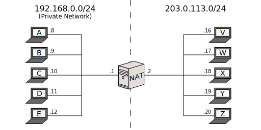
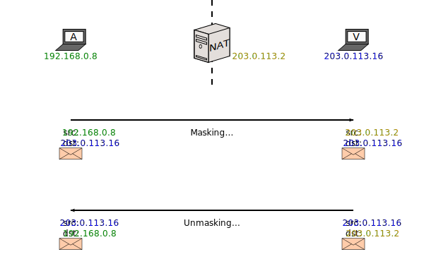
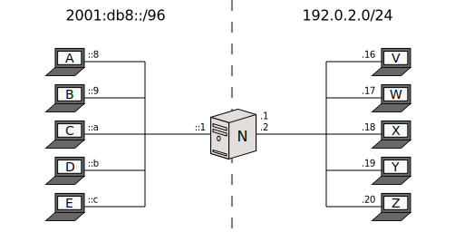
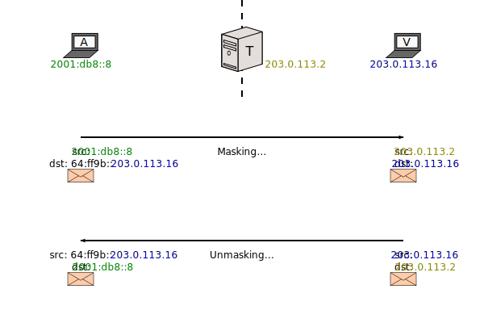

[Documentation](documentation.html) > [Introduction](documentation.html#introduction) > What is SIIT/NAT64?

# Introduction to IPv4/IPv6 Translation

## Index

1. [Introduction](#introduction)
2. [IPv4/IPv6 Translation](#ipv4ipv6-translation)
   1. [SIIT with EAM](#siit-with-eam)
   2. [SIIT (traditional)](#siit-traditional)
   3. [Stateful NAT64](#stateful-nat64)

## Introduction

This document provides a general introduction to SIIT and NAT64.

It only focuses on what, exactly, IPv4/IPv6 translators do. If you're more interested in down-to-earth setups which apply these ideas, try [Defined Architectures](documentation.html#defined-architectures).

## IPv4/IPv6 Translation

SIIT (_Stateless IP/ICMP Translation_) and NAT64 ("NAT six four", not "NAT sixty-four") are technologies meant to communicate networking nodes which only speak [IPv4](http://en.wikipedia.org/wiki/IPv4) with nodes that only speak [IPv6](http://en.wikipedia.org/wiki/IPv6).

- SIIT mangles packets, simply replacing IPv4 headers and IPv6 headers.
- _Stateful NAT64_ (or "NAT64" for short) is a combination between an SIIT and a (theoretical) IPv6 NAT; the point is to mask several IPv6 nodes behind a few IPv4 addresses.

In their basic forms, SIIT only helps communicating nodes speaking different protocols, while NAT64 also helps with [IPv4 address exhaustion](http://en.wikipedia.org/wiki/IPv4_address_exhaustion) (at the cost of being more computationally expensive and generally hindering end-to-end transparency).

For historic reasons, sometimes we mess up and label SIIT as "Stateless NAT64". Because this expression does not seem to appear in any relevant standards, we consider it imprecise, despite the fact it makes some degree of sense. If possible, please try to suppress it.

That's all, really. Keep reading for more detail and examples.

## SIIT with EAM

This is the easiest one to explain. Consider the following setup:

(_T_ stands for "Translating box".)

Assuming everyone's default gateway is _T_, how do you communicate _A_ (IPv6) with _V_ (IPv4)?

- You tell _T_, "The IPv4 address of _A_ should be 198.51.100.8, and the IPv6 address of _V_ should be 2001:db8:4::16".
- You tell _A_, "_V_'s address is 2001:db8:4::16".
- You tell _V_, "_A_'s address is 198.51.100.8".

This will happen:

The translator is "fooling" each node into thinking the other one can speak their language.

"EAM" stands for "Explicit Address Mapping", and is more versatile than simply binding arbitrary addresses to other arbitrary addresses. See the [EAM draft]({{ site.draft-siit-eam }}) or [our summary of it](eamt.html) for more information.

## SIIT (traditional)

The basic form of SIIT is more constrictive. As a consequence, we need to change the sample IPv6 network:

The idea is to simply remove a prefix while translating from IPv6 to IPv4, and append it in the other direction:

Of course, this means each node's IPv4 address has to be encoded inside its IPv6 address, which is a little annoying.

While this explanation might make it seem like "EAM" SIIT and "traditional" SIIT are different things, this is not the case. Implementations are expected to always try to translate an address based on the EAM table first, and if no mapping is found, fall back to append or remove the prefix. The separation was done here for illustrative purposes only.

SIIT is defined by [RFC 6145](http://tools.ietf.org/html/rfc6145). The address translation hack has more ways to embed the IPv4 address not shown here, and is fully defined by [RFC 6052](http://tools.ietf.org/html/rfc6052). Whenever RFC 6052 is involved, it's usually convenient to also have a [DNS64](dns64.html) so users don't need to be aware of the prefix.

[SIIT-DC](siit-dc.html) is an architecture that uses both SIIT "modes" in concert to achieve a scalable IPv4/IPv6 coexistence setup for Data Centres.

## Stateful NAT64

This mode is more akin to what people understand as "NAT". As such, allow me to remind you the big picture of how (stateful) NAT operates:

The idea is, the left network is called "Private" because it uses [addresses unavailable in the global Internet](http://en.wikipedia.org/wiki/Private_network). In order to make up for this, _NAT_ mangles packet addresses so outsiders think any traffic started by the private nodes was actually started by itself:

As a result, for outside purposes, nodes _A_ through _E_ are "sharing" _NAT_'s global address (or addresses).

While stateful NAT helps you economize IPv4 address, it comes with a price: the _NAT_ machine has to remember which private node issued the packet to _V_, because _A_'s address cannot be found anywhere in _V_'s response. That's why it's called "stateful"; it creates address mappings dymanically and remembers them for a while. There are two things to keep ind mind here:

- Each mapping requires memory.
- _V_ cannot **start** a packet stream with _A_, again because _NAT_ **must** learn the mapping in the private-to-outside direction first (left to right).

Stateful NAT64 is pretty much the same. The only difference is that the "Private Network" is actually an IPv6 network:

And therefore,

Now, that's where the similarities with NAT end. You don't normally say the IPv6 network is "Private", because the whole point is that it should also be connected to the IPv6 Internet:

In this way, _A_ through _E_ are _IPv6-only_ nodes, but they have access to both Internets (the IPv6 one via router _R_, and the IPv4 one via _T_).

Stateful NAT64 is defined by [RFC 6146](http://tools.ietf.org/html/rfc6146) and is most of the time coupled with [DNS64](dns64.html).
