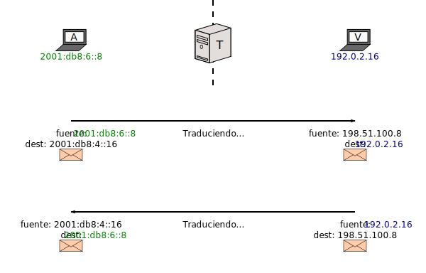
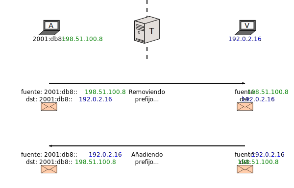
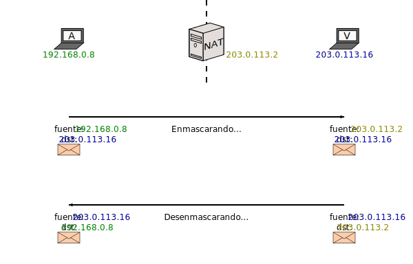
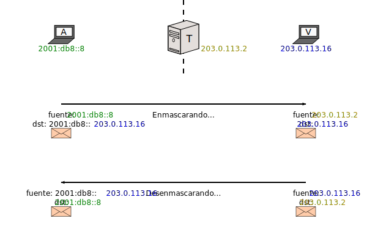
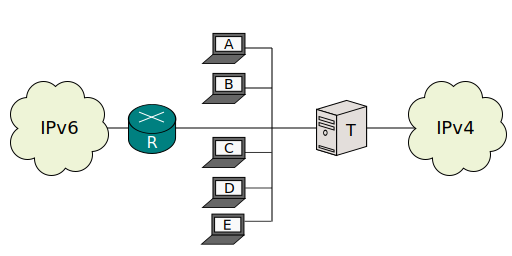

[Documentación](esp-doc-index.html) > [Introducción](esp-doc-index.html#introduccion) > NAT64

# Introducción a Traducción IPv4/IPv6

## Indice

1. [Introducción](#introduccion)
2. [Traducción IPv4/IPv6](#traudccion-ipv4ipv6)
	1. [SIIT con EAM](#siit-con-eam)
    2. [SIIT tradicional](#siit-tradicional)
    3. [Stateful NAT64](#stateful-nat64)
    
## Introducción
 Este documento proporciona una introducción general a SIIT y NAT64.
 
## Traducción IPv4/IPv6
 
 SIIT (_Stateless IP/ICMP Translation_) y NAT64 ("NAT seis cuatro", no "NAT sesenta y cuatro") son tecnologias orientadas a comunicar nodos de red que solo hablan [IPv4](http://es.wikipedia.org/wiki/IPv4) con nodos que solo hablan [IPv6](http://es.wikipedia.org/wiki/IPv6).
 La idea es básicamente la de un [NAT](http://es.wikipedia.org/wiki/Traducci%C3%B3n_de_direcciones_de_red) mejorado; un "Traductor IPv4/IPv6" no solo reemplaza direcciones y/o puertos en los paquetes, sino también headers de capa 3.
 
 - SIIT es la manera sencilla, y permite mapeos 1-a-1 preconfigurados entre IPv4 e IPv6.
 - UN _Stateful NAT64_ (o NAT64 simplemente) permite que varios nodos IPv6 compartan un rango pequeño de direcciones IPv4 (útil cuando eres victima del [Agotamiento de las direcciones de IPv4](http://es.wikipedia.org/wiki/Agotamiento_de_las_direcciones_IPv4)).
 
 Por razones históricas, algunas veces etiquetamos a SIIT como "Stateless NAT64". Ya que esta expresión no parece estar incluida en ningun estándar relevante, la consideramos imprecisa, a pesar de que tiene cierto grado de sentido. Si es possible, por favor trata de no usarla.
 
Una implementación SIIT modifica los encabezados de red y algunas veces los checksums. Un Stateful NAT64 también manipula identificadores de transporte.

Eso es todo en realidad. Continua leyendo para mas detalles y ejemplos.

## SIIT con EAM

Esta parte es la mas fácil de explicar. Considera la siguiente configuración:

(_T_ representa "Translating box" en español "Caja de traducción".)

Asumiendo que la puerta de enlace por default de todos es _T_, como comunicas _A_ (IPv6) con _V_ (IPv4)?

- Le dices a _T_, "La dirección IPv4 de _A_ debe de ser 198.51.100.8, y la dirección IPv6 de _V_ debe de ser 2001:db8:4::16 ".
- Le dices a _A_, "la dirección de _V_ es 2001:db8:4::16".
- Le dices a _V_, "la dirección de _A_ es 198.51.100.8 ".

La primera es realizada por SIIT, las demas pueden ser realizadas via DNS.

Esto sucederá:

El traductor esta "engañando" a cada nodo haciendoles pensar que el otro puede hablar el mismo lenguaje.

"EAM" representa por sus siglas en inglés "Explicit Address Mapping", y es mas versátil que un simple mapeo de direcciones aribtrarias a otras direcciones arbitrarias. Vea el [EAM draft](https://tools.ietf.org/html/draft-anderson-v6ops-siit-eam-02) o [nuestro resumen de el](esp-misc-eamt.html) para mas información.

## SIIT (tradicional)

El modo tradicional de SIIT es mas constrictivo. Como consecuencia, necesitamos cambiar la red de ejemplo IPv6:

La idea es simplemente remover un prefijo durante el mapeo de IPv6 a IPv4, y adjuntarlo en el otro sentido:

Por supuesto,esto significa que la direccion IPv4 de cada nodo tiene que ser codificada dentro de su dirección IPv6, lo cual es un poco molesto.

Aunque esta explicación pudiera hacer parecer que  SIIT "EAM" y SIIT "tradicional" son cosas diferentes, este no es el caso. Se espera que las implementaciones siempre intenten mapear una direccion basadas en la tabla EAM primero, y si no es encontrado ningun mapeo, retrocedan y adjunten o remuevan el prefijo. La separación fue hecha aqui para propositos ilustrativos. Se puede econtrar un ejemplo concreto de como SIIT "tradicional" y "EAM" pueden ser combinados para cumplir un caso de uso. [draft-v6ops-siit-dc](http://tools.ietf.org/html/draft-ietf-v6ops-siit-dc-00).

SIIT esta definido en el [RFC 6145](http://tools.ietf.org/html/rfc6145). El hack de mapeo de direcciones tiene mas maneras de adjuntar la dirección IPv4 que no se muestran aquí, y está completamente definido por el [RFC 6052](http://tools.ietf.org/html/rfc6052). Cuando sea que el RFC 6052 esté involucrado, es normalmente conveniente tener tambien un [DNS64](esp-op-dns64.html) para que los usuarios no necesiten estar al tanto del prefijo.

## Stateful NAT64

Este modo es mas parecido a lo que la gente entiende como "NAT". Como tal, me permite recordarte el panorama de como opera un (stateful) NAT:

La idea es, la red de la izquierda es llamada "Privada" por que usa [Direcciones no disponibles en la Internet Global](http://es.wikipedia.org/wiki/Red_privada). Con el objetivo de prepararse para esto, _NAT_ modifica las direcciones de los paquetes para que los nodos externos piensen que cualquier trafico iniciado por nodos internos fue iniciado por ellos:

Como resultado, para propositos externos, nodos desde _A_ hasta _E_ estan "compartiendo" direcciones globales de _NAT_.

Aunque stateful NAT ayuda a economizar direcciones IPv4, esto tiene un precio: _NAT_ tiene que recordar cual nodo privado emitió el paquete a _V_, por que la direccion de _A_ no puede ser encontrada en ningun lado dentro de la respuesta de _V_. Por eso es que es  llamado "stateful"; crea mapeos de direcciones y los recuerda por un tiempo. Hay dos cosas que se tienen que mantener en mente aqui:

- Cada mapeo require memoria.
- _V_ no puede **iniciar** una emisión de paquetes hacia _A_, otra vez por que _NAT_ **debe** aprender el mapeo en el sentido  privado-al-externo primero (izquierda a derecha).

Stateful NAT64 es muy similar. La unica diferencia es que la "Red Privada" es de hecho una red IPv6:

Y por lo tanto,

Ahora, ahi es donde las similitudes con NAT terminan. Normalmente no dices la red IPv6 es "Privada", porque el punto de todo es que tambien deberia de estar conectada a la internet IPv6:

De esta manera, desde _A_ hasta _D_ hay nodos solo de _IPv6_, pero tienen acceso a ambas Internets (A la IPv6 mediante un ruteador _R_, y a la IPv4 mediante _T_).

Stateful NAT64 esta definido por el [RFC 6146](http://tools.ietf.org/html/rfc6146) y esta la mayor parte del tiempo ligada con[DNS64](esp-op-dns64.html).

