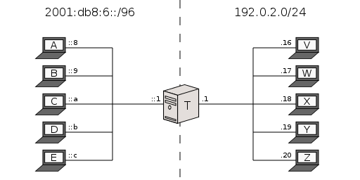
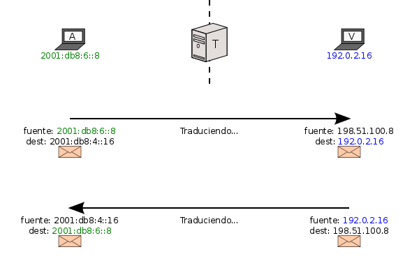
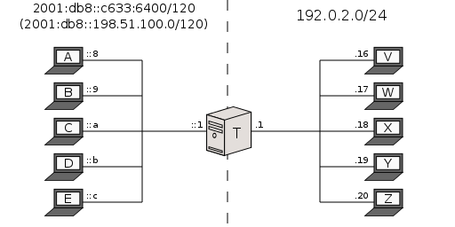
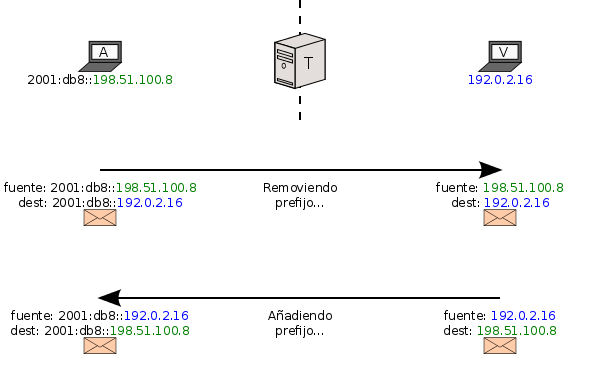
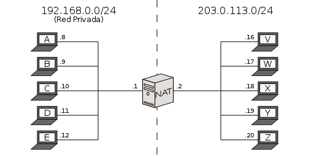
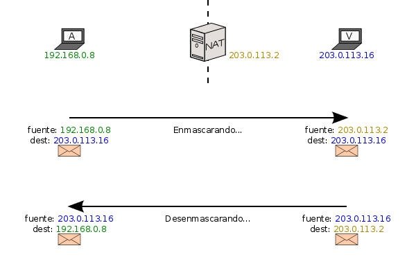
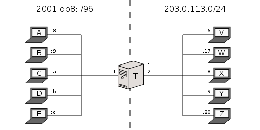
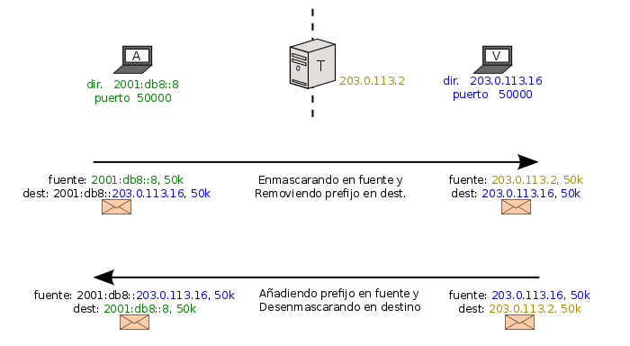

[Documentación](esp-doc-index.html) > [Introducción](esp-doc-index.html#introduccion) > Mecanismos de Transición

## Mecanismos de Transición de IPv6 soportados por Jool

## Índice

1. [Introducción](#introduccion)
2. [Ejemplos de Traducción IPv4/IPv6](#traduccion-ipv4ipv6)
	1. [`SIIT con EAM`](#siit-con-eam)
    2. [`SIIT tradicional`](#siit-tradicional)
    3. [`Stateful NAT64`](#stateful-nat64)
    
## Introducción
 Este documento proporciona una introducción general a los tres mecanismos de traducción implementados en Jool.
 
El algoritmo para SIIT fue definido formalmente a inicios del 2000 por Erik Nordmark de SUN Microsystems en el [RFC 2765] (https://tools.ietf.org/html/rfc2765). Este ha sido actualizado en varias ocasiones: [(RFC 6145, 2011)] (https://tools.ietf.org/html/rfc6145), [(RFC6791, 2012)] (https://tools.ietf.org/html/rfc6791) e inclusive [hasta nuestros días] (https://tools.ietf.org/id/siit?maxhits=100&key=date&dir=desc). De éstos, ya están incluidos en Jool el [(draft-ietf-v6ops-siit-dc, 2015)] (https://tools.ietf.org/html/draft-ietf-v6ops-siit-dc-01), el [(draft-ietf-v6ops-siit-dc-2xlat, 2015)] (https://tools.ietf.org/html/draft-ietf-v6ops-siit-dc-2xlat-01) y el [(draft-anderson-v6ops-siit-eam, 2015)] (https://tools.ietf.org/html/draft-ietf-v6ops-siit-eam-03). Estas tres adiciones a SIIT han sido propuestas y promovidas por [Tore Anderson] (http://www.redpill-linpro.com/tore-anderson#overlay-context=about-us/our-consultants) de la compañía Redpill Linpro en Noruega.

La metodología del Stateful NAT64 fue uno de los resultados del [**Proyecto Trilogy**] (http://trilogy-project.org/trilogy-and-the-ietf.html), organizado por [la Unión Europea] (http://europa.eu/rapid/press-release_IP-11-1294_es.htm), con una inversión aprox. de 9 millones de Euros, por un período de 3 años (2008 al 2010) donde participaron 5 Universidades, 4 compañías de telecomunicación y 2 centros de investigación. El estándar para el NAT64 que es el [RFC 6146] (https://tools.ietf.org/html/rfc6146) fue publicado en el 2011 por el mismo coordinador del projecto, el [Dr. Marcelo Bagnulo Braun] (http://www.it.uc3m.es/marcelo/) de la Universidad Carlos III y otros dos colaboradores del proyecto. 

:bulb: Conoce más trabajos elaborados por la IETF acerca de NAT64 en [TOOLS IETF] (https://tools.ietf.org/id/nat64?maxhits=100&key=date&dir=desc) y en [Datatracker] (https://datatracker.ietf.org/doc/search/?name=nat64&sort=&rfcs=on&activedrafts=on).

## Ejemplos de Traducción IPv4/IPv6
 
 SIIT (_Stateless IP/ICMP Translation_) y NAT64 ("NAT seis cuatro", no "NAT sesenta y cuatro") son tecnologías orientadas a comunicar nodos de red que únicamente hablan [IPv4](http://es.wikipedia.org/wiki/IPv4) con nodos que solo hablan [IPv6](http://es.wikipedia.org/wiki/IPv6).
 La idea es básicamente la de un [NAT](http://es.wikipedia.org/wiki/Traducci%C3%B3n_de_direcciones_de_red) mejorado; es decir que, un "Traductor IPv4/IPv6" no solo reemplaza direcciones y/o puertos en los paquetes, sino también encabezados de capa 3.
 
 - **SIIT**, es la manera sencilla, permitiendo MAPEOS 1-a-1 preconfigurados entre IPv4 e IPv6. 
 Es decir, que en SIIT tú establecerás lo siguiente: 
 a) Para cada uno de tus nodos en IPv6 existirá una dirección alterna en IPv4. 
 b) Para cada uno de tus nodos en IPv4 existirá una dirección alterna en IPv6.

 - **Stateful NAT64**, o simplemente NAT64,  permite que VARIOS NODOS IPv6 compartan UN RANGO PEQUEÑO de direcciones IPv4. 
 Es decir, que en NAT64 tú establecerás lo siguiente: 
 a) Para cada uno de tus nodos en IPv4 existirá una dirección alterna en IPv6, pero esa nueva dirección estará formada de un prefijo de IPv6 + dir. en IPv4. 
 b) Los nodos en IPv6 será identificados por una o varias IP válidas en _T_ (Jool), aparentando ser una "Red Privada de IPv4" (red local).
 
NAT64 es definitivamente útil cuando se dispone de un [número restringido de direcciones de IPv4](http://es.wikipedia.org/wiki/Agotamiento_de_las_direcciones_IPv4).
 
Por razones históricas, algunas veces etiquetamos a SIIT como "Stateless NAT64". Ya que esta expresión no parece estar incluida en ningún estándar relevante, la consideramos imprecisa, a pesar de que tiene cierto grado de sentido. Si es possible, por favor trata de no usarla.
 
En una implementación SIIT siempre se modifican los encabezados de red y en algunas veces los checksums. En un Stateful NAT64 también se manipulan los identificadores de transporte.

### `SIIT con EAM`

Esta parte es la más fácil de explicar. Considera la siguiente configuración:

(_T_ representa "Translating box". En español "Caja de traducción".)

Asumiendo que la puerta de enlace por default de todos es _T_, comó comunicarías _A_ (IPv6) con _V_ (IPv4)?

Para lograr la comunicación entre _A_ y _V_ bastaría con establecer lo siguiente:

- Le dices a _A_, "la dirección de _V_ es 2001:db8:4::16".
- Le dices a _V_, "la dirección de _A_ es 198.51.100.8 ".
- Le dices a _T_, "La dirección IPv4 de _A_ debe de ser 198.51.100.8,  
                   y la dirección IPv6 de _V_ debe de ser 2001:db8:4::16".

La primera es resuelta por SIIT, las demás pueden ser realizadas vía DNS.

Veamos:

El traductor esta "engañando" a ambos nodos haciéndoles pensar que el otro puede hablar el mismo lenguaje.

"EAM" significa por sus siglas en inglés "Explicit Address Mapping", mapeo de direcciones explícitas. Es más versátil que un simple mapeo de direcciones aribtrarias a otras direcciones arbitrarias.

:bulb: Revisa [nuestro resumen](esp-misc-eamt.html) o repasa sus especificaciones en el [draft EAM](http://tools.ietf.org/html/draft-ietf-v6ops-siit-eam-01).

### `SIIT (tradicional)`

El modo básico es un poco más complejo. Las direcciones no son remplazadas completamente por otras, sino una parte será usada en su dirección asociada con el otro protocolo. Considera la siguiente configuración:

Para lograr la comunicación entre _A_ y _V_ bastaría con establecer lo siguiente:

- Le dices a _A_, "la dirección de _V_ es 2001:db8:192.0.2.16".
- Le dices a _V_, "la dirección de _A_ es 198.51.100.8 ".
- Le dices a _T_, "La dirección IPv4 de _A_ debe de ser 198.51.100.8,  
                   y la dirección IPv6 de _V_ debe de ser 2001:db8:192.0.2.16".

La idea es, simplemente remover _el prefijo_ durante el mapeo de IPv6 a IPv4, y adjuntarlo en el otro sentido. Como lo puedes apreciar en la siguiente figura:

Por supuesto, esto significa que la dirección IPv4 de cada nodo en IPv6 tiene que ser codificada dentro de su dirección, lo cual es un poco engorroso.

Podría parecerte que  SIIT con "EAM" y SIIT "tradicional" son cosas diferentes, pero pueden trabajar a la par. En implementaciones de este tipo, primeramente se intentará mapear las direcciones IP consultando la tabla EAM (según SIIT con EAM), y si NO están registradas, se retrocede y se añade o se remueve el prefijo (según SIIT).

Puedes encontrar un ejemplo concreto de como SIIT "tradicional" y "EAM" pueden ser combinados eficientemente para cumplir un caso de uso en la siguiente propuesta de solución para Centros de Datos: [draft-v6ops-siit-dc](http://tools.ietf.org/html/draft-ietf-v6ops-siit-dc-02).

Dependiendo de la longitud del prefijo, la dirección IPv4 se incorporará en diferentes posiciones dentro de nuestro rango de 128 bits según se establece en el [RFC 6052](http://tools.ietf.org/html/rfc6052).

:warning: Siempre que el RFC 6052 esté involucrado, es muy conveniente dar de alta también un [DNS64](esp-op-dns64.html) para que  
          los usuarios no necesiten estar al tanto del prefijo, y resuelva por nombre.

### `Stateful NAT64`

Este modo es el más parecido a lo que la gente entiende como **NAT**, por sus siglas en inglés de _IP Network Address Translator_. Recordemos, un NAT opera de la siguiente manera:

Note que, la red de la izquierda es llamada "Privada" por que usa [Direcciones no disponibles en la Internet Global](http://es.wikipedia.org/wiki/Red_privada).  _NAT_ modifica las direcciones de los paquetes para que los nodos externos piensen que el tráfico proveniente de los nodos internos fue en realidad iniciado por el _NAT_:

Es decir que para propósitos externos, los nodos desde _A_ hasta _E_ están "compartiendo" la misma dirección global de _NAT_ (o grupo de direcciones).

Aunque NAT ayuda a reducir el empleo de direcciones globales en Internet de IPv4, esto tiene un precio: _NAT_ tiene que recordar cual nodo privado emitió el paquete a _V_, porque la dirección de _A_ fue suprimida dentro de la respuesta de _V_. Por eso, es que es  llamado ***stateful***, porque guarda el estado de las sesiones, pues crea mapeos de direcciones y los recuerda por un tiempo. 

Dos cosas que hay que tomar en cuenta es:

- Cada mapeo require memoria.
- _V_ no puede **iniciar** la comunicación con _A_, porque primeramente el _NAT_ **debe** aprender el mapeo en el sentido de la Red_Privada-a-Red_Externa (de izquierda a derecha).

Si quieres saber más sobre NAT y sus diferentes tipos, consulta los siguientes documentos: [RFC 2663](https://tools.ietf.org/html/rfc2663#section-3), [RFC 2766](https://tools.ietf.org/html/rfc2766) y [RFC 3022](https://tools.ietf.org/html/rfc3022).

**Stateful NAT64** es muy similar a un NAT-PT (_Protocol Translation_). La única diferencia es que la "Red Privada" es de hecho una red IPv6:

Para lograr la comunicación entre _A_ y _V_ bastaría con establecer lo siguiente:

- Le dices a _A_, "la dirección de _V_ es 2001:db8:203.0.113.16".
- Le dices a _V_, "la dirección de _A_ es 203.0.113.2 (_T_)".
- Le dices a _T_, "La dirección IPv4 de _A_ debe de ser  203.0.113.2 (_T_),  
                   y la dirección IPv6 de _V_ debe de ser 2001:db8:203.0.113.16".

La idea es, enmascarar _A_ y remover el prefijo a _V_ durante el mapeo de IPv6 a IPv4, y adjuntar el prefijo en _V_ y quitar la máscara a _A_ cuando va de IPV4 a IPv6. Como lo puedes apreciar en la siguiente figura:

NAT64 maneja otros escenarios y es aquí donde termina la similitud con NAT. Debido a que en IPv6 la capacidad de identificación de los nodos es sumamente enorme, se contempla que cada dispositivo cuente con una dirección pública de IPv6. En otras palabras se prevé o planea que TODOS los dispositivos en IPv6  tenga acceso a Internet. Considerando esto, una conectividad posible sería:

De esta manera, los nodos _A_ hasta _E_ son solo de _IPv6_, pero tienen acceso a ambas Internets. A la IPv6 mediante un ruteador _R_, y a la IPv4 mediante _T_.

Si gustas conocer el resto de los **escenarios posibles en Stateful NAT64 y SIIT** consulta el [RFC 6144, cap. 2] (https://tools.ietf.org/html/rfc6144#section-2).

:warning: Para soportar direccionamiento por nombre se requiere habilitar el [DNS64](esp-op-dns64.html).
