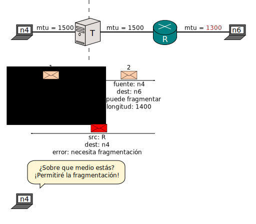
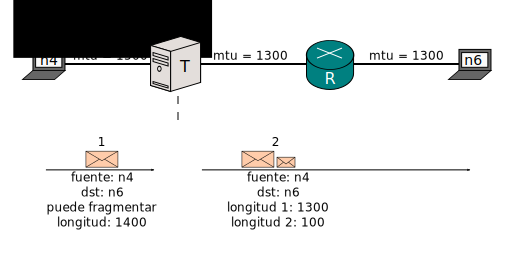

[Documentación](esp-doc-index.html) > [Otros](esp-doc-index.html#otros) > MTU y Fragmentación

# MTU y Fragmentación

## Enunciación del problema

Hay una diferencia principal entre IPv4 e IPv6 la cual un traductor IP no puede compensar.

La cabecera de un paquete IPv4 con tiene un "parámetro" llamado **No Fragmentar** o en inglés [_Don't fragment_](http://en.wikipedia.org/wiki/IPv4#Packet_structure)(DF). Determina si la fuente le permite a los routers fragmentar el paquete.

En IPv6, los paquetes nunca pueden ser fragmentados por los routers. Es como si el parámetro **No Fragmentar** siempre estuviera encendido.

Cuando hay un traductor en el medio, un paquete IPv4 el cual puede ser fragmentado se convierte en un paquete IPv6 que no debe de ser fragmentado.

Asi que, que pasa si el paquete es muy grande?

(Los tamaños actuales de los paquetes son diferentes debido a cambios en los headers, pero entiendes el punto.)

Esta definido por implementación. Si _n4_ es inteligente, tratará de decrementar la longitud del paquete. Si no, el paquete nunca llegará a _n6_.

Implementaciones apropiadas de hecho utilizan [Path MTU discovery](http://en.wikipedia.org/wiki/Path_MTU_Discovery) y por lo tanto jamas desactivan el parámetro de **No Fragmentar**. 

It's implementation defined. If _n4_ is smart, it will try to decrease the lenght of the packet. If it's not, the packet will never reach _n6_.

Proper implementations today actually use [Path MTU discovery](http://en.wikipedia.org/wiki/Path_MTU_Discovery) and therefore never unset the DF flag. Still, stubborn or legacy code is not unheard of.

Por cierto: cuando quieras saber el MTU de un link, preguntale a Linux:

<pre><code class="bash">$ ip link
(...)
2: eth0: &lt;BROADCAST,MULTICAST,UP,LOWER_UP&gt; <strong>mtu 1500</strong> qdisc pfifo_fast state UP mode DEFAULT group default qlen 1000
    link/ether 08:00:27:bf:a6:6e brd ff:ff:ff:ff:ff:ff
</code></pre>

## Solución

Si conoces el MTU más pequeño a lo largo de todas tus redes IPv6, dile a _T_ sobre el:

_T_ sabe que está traduciendo, asi que sabe que **tiene** que fragmentar aunque es una especie de router IPv6.

Jool solia tener un parámetro llamado `--minMTU6` para hacer esto. Ya que confiar la fragmentación al kernel es considerada una mejor práctica, ahora lo configuras en Linux desde la versión de Jool 3.3.

	ip link set dev eth0 mtu 1300

Y voilà:

Si no sabes el MTU mínimo de tus redes IPv6, asigna 1280. Todo nodo IPv6 debe de ser capáz de manejar por lo menos 1280 bytes por paquete de forma estandarizada.

