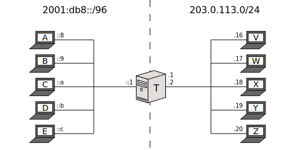

[Documentación](esp-doc-index.html) > [Ejemplos de uso](esp-doc-index.html#ejemplosdeuso) > Stateful NAT64

# Stateful NAT64: Ejemplo de Uso

## Índice

1. [Introducción](#introduccion)
2. [Red de ejemplo](#red-de-ejemplo)
3. [Jool](#jool)
4. [Pruebas](#pruebas)
5. [Deteniendo Jool](#deteniendo-jool)
6. [Lecturas adicionales](#lecturas-adicionales)

## Introducción

Este documento explica como ejecutar Jool en [modo Stateful NAT64](esp-intro-nat64.html#stateful-nat64).

En cuanto al software, solo una [instalación exitosa del modulo de kernel](esp-mod-install.html) es reqieroda. La aplicación de espacio de usuario no se necesita en esta ejecución básica.

## Red de ejemplo

Todas las observaciones en el primer documento en la [sección Red de ejemplo](esp-mod-run-vanilla.html#red-de-ejemplo) aplican aquí.

Nodos desde _A_ hasta _E_:


user@A:~# service network-manager stop
user@A:~# /sbin/ip link set eth0 up
user@A:~# # Replace "::8" depending on which node you're on.
user@A:~# /sbin/ip address add 2001:db8::8/96 dev eth0
user@A:~# /sbin/ip route add default via 2001:db8::1


Nodos desde _V_ hasta _Z_:


user@V:~# service network-manager stop
user@V:~# /sbin/ip link set eth0 up
user@V:~# # Replace ".16" depending on which node you're on.
user@V:~# /sbin/ip address add 203.0.113.16/24 dev eth0


Ten en cuenta que estos nodos no necesitan una ruta por defecto. Esto es consecuencia de que se encuentran en la misma red junto con el NAT64; 203.0.113.2 estará enmascarando los nodos IPv6, asi que desde _V_ hasta _Z_ piensan que estan hablando directamente con _T_.

Nodo _T_:


user@T:~# service network-manager stop
user@T:~# 
user@T:~# /sbin/ip link set eth0 up
user@T:~# /sbin/ip address add 2001:db8::1/96 dev eth0
user@T:~# 
user@T:~# /sbin/ip link set eth1 up
user@T:~# /sbin/ip address add 203.0.113.1/24 dev eth1
user@T:~# /sbin/ip address add 203.0.113.2/24 dev eth1
user@T:~# 
user@T:~# sysctl -w net.ipv4.conf.all.forwarding=1
user@T:~# sysctl -w net.ipv6.conf.all.forwarding=1
user@T:~# 
user@T:~# ethtool --offload eth0 tso off
user@T:~# ethtool --offload eth0 ufo off
user@T:~# ethtool --offload eth0 gso off
user@T:~# ethtool --offload eth0 gro off
user@T:~# ethtool --offload eth0 lro off
user@T:~# ethtool --offload eth1 tso off
user@T:~# ethtool --offload eth1 ufo off
user@T:~# ethtool --offload eth1 gso off
user@T:~# ethtool --offload eth1 gro off
user@T:~# ethtool --offload eth1 lro off


En modo Stateful es especial en el sentido de que el NAT64 necesita por lo menos dos direcciones IPv4 separadas:

- Una o mas direcciones utilizadas para el trafico local (ej. hacia y desde _T_). En la configuración de arriba, esta es  203.0.113.1.
- Una o mas direcciones utilizadas para la traducción NAT64. Linux necesita estar consciente de estas por que necesita enviarles una respuesta ARP. Esta es 203.0.113.2.

La necesidad de esta separación es una _peculiaridad de Joolk_ y nos encontramos investigando maneras de separarla.

Las direcciones de traudcción necesitan menos prioridad asi que _T_ no las usa para el trafico local por accidente. Una manera de lograr esto es simplemente añadiendo las direcciones NAT64 despues de las direcciones de nodo.

Recuerda que quizá quieras hacer un cross-ping de _T_ con todo antes de continuar.

## Jool

This is the insertion syntax:

	user@T:~# /sbin/modprobe jool \
		[pool6=<IPv6 prefix>] \
		[pool4=<IPv4 prefixes>] \
		[disabled]

- `pool6` tiene el mismo significado que en SIIT Jool.
- `pool4` es el subconjunto de direcciones de los nodos que seran utilizadas para la traducción (la longitud del prefijo es /32 por defecto).
- `disabled` tiene el mismo significado que en SIIT Jool.

EAM y `pool6791` no tienen sentido en modo stateful, y como tal no estan disponibles.

El resultado luce como esto:

	user@T:~# /sbin/modprobe jool pool6=64:ff9b::/96 pool4=203.0.113.2

Jool escuchará en la dirección `203.0.113.2` y agrega y remueve el prefijo `64:ff9b::/96`.

## Pruebas

Si algo no funciona, intenta con el [FAQ](esp-misc-faq.html).

Prueba mandando paquetes desde la red IPv6:


user@C:~$ ping6 64:ff9b::203.0.113.16
PING 64:ff9b::192.0.2.16(64:ff9b::c000:210) 56 data bytes
64 bytes from 64:ff9b::cb00:7110: icmp_seq=1 ttl=63 time=1.13 ms
64 bytes from 64:ff9b::cb00:7110: icmp_seq=2 ttl=63 time=4.48 ms
64 bytes from 64:ff9b::cb00:7110: icmp_seq=3 ttl=63 time=15.6 ms
64 bytes from 64:ff9b::cb00:7110: icmp_seq=4 ttl=63 time=4.89 ms
^C
--- 64:ff9b::203.0.113.16 ping statistics ---
4 packets transmitted, 4 received, 0% packet loss, time 3004ms
rtt min/avg/max/mdev = 1.136/6.528/15.603/5.438 ms


See the further reading below to see how to enable IPv4 nodes to start communication.

## Deteniendo Jool

Para detener Jool, revierte el modprobe usando el parámetro `-r`:


user@T:~# /sbin/modprobe -r jool


## Lecturas adicionales

1. Un nodo IPv4 externo no puede iniciar la comunicación por que el ve la red IPv6 como una red privada IPv4 que esta atras de un NAT. Para remediar esto, Jool te permite configurar el "redireccionamiento de puertos"(port forwarding). Ingresa [aqui](esp-op-static-bindings.html) si estas interesadp.
2. Hay una discudión sober el [pool IPv4](op-pool4.html).
3. El [documento de DNS64](esp-op-dns64.html) te dirá como hacer el hack prefijo-dirección transparente a los usuarios.
4. Por favor considera los [detalles de MTU](esp-misc-mtu.html) antes de liberar.
5. También hay un [ejemplo de uso alternativo de stateful](esp-mod-run-alternate.html). Quizá te ayude a ver las cosas desde una mejor perspectiva.
