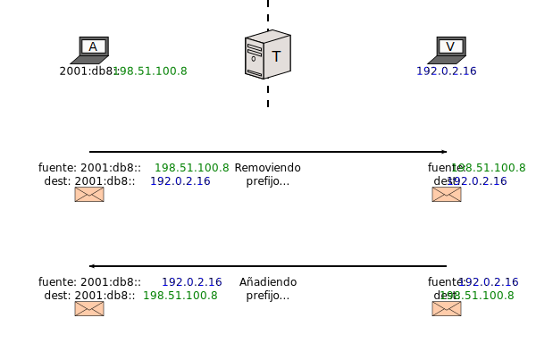
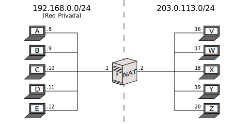
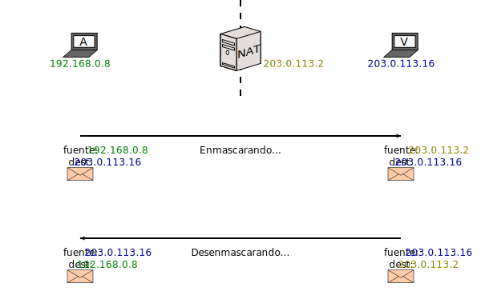
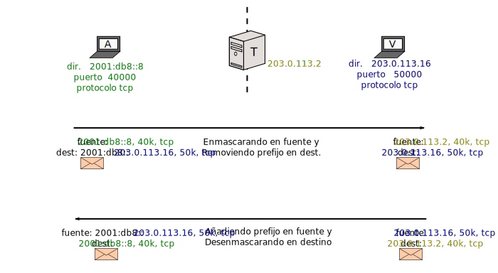

[Documentación](documentation.html) > [Introducción](documentation.html#introduccin) > Mecanismos de Transición

## Introducción a la Traducción IPv4/IPv6

## Índice

1. [Introducción](#introduccin)
2. [Traducción IPv4/IPv6](#ipv4iv6-traduccin)
	1. [SIIT con EAM](#siit-con-eam)
    2. [SIIT tradicional](#siit-tradicional)
    3. [Stateful NAT64](#stateful-nat64)
3. [Nota Histórica](#nota-histrica)
    
## Introducción

Este documento proporciona una introducción general a SIIT y NAT64.
 
Solamente se concentra en exponer la tarea y propósito de lo que hace un traductor IPv6/IPv4. Se recomienda ver [arquitecturas definidas](documentation.html#arquitecturas-definidas) si se desean ejemplos aplicados.

## Traducción IPv4/IPv6
 
SIIT (_Stateless IP/ICMP Translation_) y NAT64 ("NAT seis cuatro", no "NAT sesenta y cuatro") son tecnologías orientadas a comunicar nodos de red que únicamente hablan [IPv4](http://es.wikipedia.org/wiki/IPv4) con nodos que solo hablan [IPv6](http://es.wikipedia.org/wiki/IPv6).

- **SIIT** es la forma más simple, y permite mapeos preconfigurados 1-a-1 entre direcciones IPv4 e IPv6.
- **Stateful NAT64** ("NAT64" en corto) es una combinación entre un SIIT y un teórico NAT66. La idea es enmascarar a varios nodos de IPv6 usando unas pocas direcciones IPv4.

En sus formas básicas, SIIT solamente comunica a nodos que utilizan diferentes protocolos, mientras que NAT64 también ayuda con el [agotamiento de direcciones IPv4](https://es.wikipedia.org/wiki/Agotamiento_de_las_direcciones_IPv4) (al precio de ser más pesado computacionalmente y obstaculizar transparencia de direcciones).

Por razones históricas, algunas veces etiquetamos erróneamente a SIIT como "Stateless NAT64". Esta expresión no está incluida en ningún estándar relevante, de modo que la consideramos imprecisa (a pesar de que tiene cierto grado de sentido). Si es posible, por favor trate de evitarla.

A continuación se exponen más detalles y ejemplos.

### SIIT con EAM

Esta es la modalidad más sencilla de explicar. Considere la siguiente configuración:

(_T_ representa "traductor".)

Asumiendo que la puerta de enlace por default de todos es _T_, comó se podría comunicar _A_ (IPv6) con _V_ (IPv4)?

- Se le indica a _T_, "La dirección IPv4 de _A_ debe ser 198.51.100.8,  
                   y la dirección IPv6 de _V_ debe ser 2001:db8:4::16".
- Se le indica a _A_, "la dirección de _V_ es 2001:db8:4::16".
- Se le indica a _V_, "la dirección de _A_ es 198.51.100.8 ".

El primer punto puede lograrse mediante SIIT. Los otros pueden ser hechos vía DNS.

Esto es lo que va a suceder:

El traductor esta "engañando" a ambos nodos, haciéndoles pensar que el otro puede hablar su mismo protocolo.

"EAM" es abreviación de "Explicit Address Mapping" (Mapeo Explícito de Direcciones), y es más versátil que simples asociaciones entre diferentes direcciones arbitrarias.

 Más detalles sobre EAM pueden encontrarse en este [resumen](eamt.html) o en el [documento de la IETF]({{ site.draft-siit-eam }}).

### SIIT (tradicional)

El modo básico es más constrictivo. Por lo tanto, es necesario modificar la red:

Para lograr la comunicación entre _A_ y _V_ bastaría con establecer lo siguiente:

- Se le indica a _T_, "Tu prefijo de traducción es 2001:db8::/96".
- Se le indica a _A_, "la dirección de _V_ es 2001:db8::192.0.2.16".
- Se le indica a _V_, "la dirección de _A_ es 198.51.100.8".

La idea es simplemente remover el prefijo de traducción en la dirección IPv6 a IPv4, y adjuntarlo en el otro sentido. Este sería el flujo:

Por supuesto, esto significa que la dirección IPv4 de cada nodo en IPv6 tiene que ser codificada dentro de su dirección IPv6, lo cual es un poco engorroso.

Dependiendo de la longitud del prefijo, la dirección IPv4 se incorporará en diferentes posiciones dentro de la dirección de IPv6. Puede encontrarse más información en el [RFC 6052](http://tools.ietf.org/html/rfc6052).

 Siempre que el RFC 6052 esté involucrado, es conveniente incluir un [DNS64](dns64.html) para que los usuarios no tengan que conocer el prefijo.

Podría parecer que "SIIT con EAM" y SIIT "tradicional" son cosas diferentes, pero siendo ambos suscriptores de la misma idea básica (mapeo de direcciones 1 a 1), ambos son en realidad SIIT. El prefijo de traducción y la EAMT pueden usarse en concierto; en esta explicación se separaron solamente para propósitos ilustrativos.

[SIIT-DC](siit-dc.html) es una arquitectura que usa ambos "modos" de SIIT para lograr una coexistencia escalable entre IPv4 e IPv6 para Data Centres.

### Stateful NAT64

Este modo es más parecido a lo que normalmente se conoce como **NAT** (_Network Address Translation_) (aunque más específicamente es un [NAPT](https://tools.ietf.org/html/rfc2663#section-4.1.2)). Por lo tanto, es conveniente recordar cómo opera un NAT:

Note que la red de la izquierda es llamada "Privada" porque usa [direcciones no disponibles en la Internet Global](http://es.wikipedia.org/wiki/Red_privada). _NAT_ modifica las direcciones de los paquetes para que los nodos externos piensen que el tráfico proveniente de los nodos internos fue en realidad iniciado por él mismo:

Desde el punto de vista del operador, los nodos _A_, _B_, _C_, _D_, _E_ y _NAT_ están "compartiendo" la(s) dirección(es) global(es) de _NAT_.

El precio de poder condensar las direcciones de varios nodos en las de uno solo es que el intermediario tiene que guardar estado; la dirección del nodo oculto se borra completamente del paquete durante el enmascarado, de modo que _NAT_ tiene que memorizarlo para saber a quién enviar la respuesta una vez llega.

Dos cosas que hay que tomar en cuenta es:

- _NAT_ tiene un número de mapeos (máscaras) limitado por disponibilidad (direcciones de transporte) y/o memoria. En otras palabras, puede ser víctima de una ataque DoS.
- _V_ no puede **iniciar** la comunicación con _A_, porque _NAT_ no puede inferir el destino a partir de un paquete que no ha enmascarado (y por lo tanto, no recuerda). NAT asume que la mayoría de la comunicación va a ser iniciada por la red privada.

<!--
	Paty: Es mejor no mencionar a NAT-PT por dos razones:
	1. No es un "NAT" (o más bien dicho, no es un "NAT44"); es el precursor de SIIT/NAT64.
	2. Está deprecado (trajo muchos problemas, y por lo tanto salió SIIT/NAT64).
 -->

>  Si quieres saber más sobre NAT, consulta los RFCs [2663](https://tools.ietf.org/html/rfc2663#section-3) y [3022](https://tools.ietf.org/html/rfc3022).

**Stateful NAT64** es muy similar a NAT. Conceptualmente, la única diferencia es que la "Red Privada" es de hecho una red (pública) de IPv6:

Para lograr la comunicación entre _A_ y _V_ bastaría con establecer lo siguiente:

- Se le indica a _A_, "la dirección de _V_ es 64:ff9b::203.0.113.16".
- A _V_ no se le indica nada; él cree que está hablando con _T_.
- Se le indica a _T_, "Usa tu dirección para enmascarar a _A_" y "Pretende que el Internet IPv4 es una red llamada 64:ff9b::/96".

Hasta ahí llegan las similitudes con NAT. En NAT64 la red oculta no se llama "privada" porque el punto es que los nodos de IPv6 no se ocultan detrás de un único gateway hacia IPv4; por el contrario, _T_ solamente desemboca hacia la "subred" que es el Internet de IPv4. El Internet de IPv6 es alcanzable desde otro gateway:

Por lo tanto, los nodos _A_ hasta _E_ solamente tienen stacks de _IPv6_, pero pueden acceder a ambas Internets.

Si gustas conocer el resto de los **escenarios posibles en Stateful NAT64 y SIIT** consulta el [RFC 6144, cap. 2](https://tools.ietf.org/html/rfc6144#section-2).

 Para soportar direccionamiento por nombre se requiere habilitar el [DNS64](dns64.html).

## Nota Histórica

Sobre el orígen y desarrollo de estas metodologías:

* El algoritmo para SIIT fue definido formalmente a inicios del 2000 por Erik Nordmark de SUN Microsystems en el [RFC 2765](https://tools.ietf.org/html/rfc2765). Este ha sido actualizado en varias ocasiones: [(RFC 6145, 2011)](https://tools.ietf.org/html/rfc6145), [(RFC6791, 2012)](https://tools.ietf.org/html/rfc6791) e inclusive [hasta nuestros días](https://tools.ietf.org/id/siit?maxhits=100&key=date&dir=desc). De éstos, ya están incluidos en Jool el [(draft-ietf-v6ops-siit-dc, 2015)]({{ site.draft-siit-dc }}), el [(draft-ietf-v6ops-siit-dc-2xlat, 2015)]({{ site.draft-siit-dc-2xlat }}) y el [(draft-anderson-v6ops-siit-eam, 2015)]({{ site.draft-siit-eam }}). Estas tres adiciones a SIIT han sido propuestas y promovidas por [Tore Anderson](http://www.redpill-linpro.com/tore-anderson#overlay-context=about-us/our-consultants) de la compañía Redpill Linpro en Noruega.
* El algoritmo de Stateful NAT64 fue uno de los resultados del [**Proyecto Trilogy**](http://trilogy-project.org/trilogy-and-the-ietf.html), organizado por [la Unión Europea](http://europa.eu/rapid/press-release_IP-11-1294_es.htm), con una inversión aprox. de 9 millones de Euros, por un período de 3 años (2008 al 2010) donde participaron 5 Universidades, 4 compañías de telecomunicación y 2 centros de investigación. El estándar para el NAT64 que es el [RFC 6146](https://tools.ietf.org/html/rfc6146) fue publicado en el 2011 por el mismo coordinador del projecto, el [Dr. Marcelo Bagnulo Braun](http://www.it.uc3m.es/marcelo/) de la Universidad Carlos III y otros dos colaboradores del proyecto. 
* Conoce más trabajos elaborados por la IETF acerca de NAT64 en [TOOLS IETF](https://tools.ietf.org/id/nat64?maxhits=100&key=date&dir=desc) y en [Datatracker](https://datatracker.ietf.org/doc/search/?name=nat64&sort=&rfcs=on&activedrafts=on).
