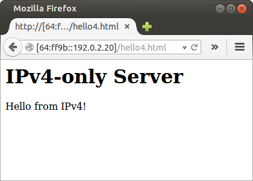

[Documentación](documentation.html) > [Ejemplos de uso](documentation.html#ejemplos-de-uso) > Stateful NAT64

# Stateful NAT64: Ejemplo de Uso

## Índice

1. [Introduccion](#introduccion)
2. [Red de ejemplo](#red-de-ejemplo)
	1. [`Configuracion de Nodos en IPv6`](#configuracion-de-nodos-en-ipv6)
	2. [`Configuracion de Nodos en IPv4`](#configuracion-de-nodos-en-ipv4)
	3. [`Configuracion del Nodo Traductor`](#configuracion-del-nodo-traductor)
3. [Jool](#jool)
4. [Pruebas](#pruebas)
	1. [`Conectividad de IPv6 a IPv4`](#conectividad-de-ipv6-a-ipv4)
	2. [`Conectividad a un Web Server en IPv4`](#conectividad-a-un-web-server-en-ipv4)
5. [Deteniendo Jool](#deteniendo-jool)
6. [Lecturas adicionales](#lecturas-adicionales)

## Introduccion

Este documento explica como ejecutar Jool en modo Stateful NAT64. Si no tienes nociones de este tipo de traducción ingresa a [Stateful NAT64](intro-nat64.html#stateful-nat64).

Similar a los modos anteriores, solo necesitas una instalación exitosa de del [Servidor Jool](mod-install.html). El Configurador no se necesita en esta ejecución básica.

## Red de ejemplo

Aquí también, son válidas y aplican las observaciones mencionadas de la [sección Red de Ejemplo para SIIT](mod-run-vanilla.html#red-de-ejemplo) exceptuando dos: el del uso de direcciones en el segmento 198.51.100.8/29 y el default gateway. Resumiéndolas, tenemos que:

- Al menos necesitarás tres nodos: _A_, _V_ y _T_.
- Jool requiere Linux, los otros Nodos no necesariamente.
- Para este tutorial, consideraremos que: a)todos están en Linux, b)su configuración de red se hará manualmente.

### `Configuracion de Nodos en IPv6`

Para los nodos de _A_ a _E_, ejecuta la siguiente secuencia de comandos con permisos de administrador:


user@A:~# service network-manager stop
user@A:~# /sbin/ip link set eth0 up
user@A:~# # Replace "::8" depending on which node you're on.
user@A:~# /sbin/ip address add 2001:db8::8/96 dev eth0
user@A:~# /sbin/ip route add default via 2001:db8::1


### `Configuracion de Nodos en IPv4`

Para los nodos de _V_ a _Z_, ejecuta la siguiente secuencia de comandos con permisos de administrador:


user@V:~# service network-manager stop
user@V:~# /sbin/ip link set eth0 up
user@V:~# # Replace ".16" depending on which node you're on.
user@V:~# /sbin/ip address add 203.0.113.16/24 dev eth0


Estos nodos no necesitan una ruta por defecto. Esto es consecuencia de que se encuentran en la misma red junto con el NAT64. Como la dirección 203.0.113.2 estará enmascarando los nodos IPv6, asi que desde _V_ hasta _Z_ piensan que están hablando directamente con _T_.

### `Configuracion del Nodo Traductor`

Para el Nodo _T_, ejecuta la siguiente secuencia de comandos con permisos de administrador:


user@T:~# service network-manager stop
user@T:~# 
user@T:~# /sbin/ip link set eth0 up
user@T:~# /sbin/ip address add 2001:db8::1/96 dev eth0
user@T:~# 
user@T:~# /sbin/ip link set eth1 up
user@T:~# /sbin/ip address add 203.0.113.1/24 dev eth1
user@T:~# /sbin/ip address add 203.0.113.2/24 dev eth1
user@T:~# 
user@T:~# ethtool --offload eth0 tso off
user@T:~# ethtool --offload eth0 ufo off
user@T:~# ethtool --offload eth0 gso off
user@T:~# ethtool --offload eth0 gro off
user@T:~# ethtool --offload eth0 lro off
user@T:~# ethtool --offload eth1 tso off
user@T:~# ethtool --offload eth1 ufo off
user@T:~# ethtool --offload eth1 gso off
user@T:~# ethtool --offload eth1 gro off
user@T:~# ethtool --offload eth1 lro off


En modo Stateful es especial en el sentido de que el NAT64 necesita por lo menos dos direcciones IPv4 separadas:

- Una o más direcciones utilizadas para el trafico local (ej. hacia y desde _T_). En la configuración de arriba, esta es  203.0.113.1.
- Una o más direcciones utilizadas para la traducción NAT64. Linux necesita estar consciente de éstas por que necesita enviarles una respuesta ARP. En nuestro ejemplo es 203.0.113.2.

La necesidad de esta separación es una _peculiaridad de Jool_ y estamos investigando como eliminarla.

Las direcciones de traducción requieren menos prioridad que las del tráfico local para que _T_ no las use por accidente. Una manera de lograr esto, es simplemente añadiendo las direcciones NAT64 después de las direcciones de nodo.

Recuerda que quizá quieras asegurarte de que _T_ puede comunicarse con todos los nodos antes de continuar.

## Jool

Esta es la sintaxis para insertar Jool Stateful NAT64 en el kernel: 
(Requieres permiso de administración)

	user@T:~# /sbin/modprobe jool \
		[pool6=<IPv6 prefix>] \
		[pool4=<IPv4 prefixes>] \
		[disabled]

- `pool6` es el prefijo que el mecanismo de traducción estará adjuntando y removiendo de las direcciones de los paquetes.

- `pool4` es el subconjunto de direcciones de los nodos que seran utilizadas para la traducción (la longitud del prefijo es /32 por defecto).

- `disabled`  inicia Jool en modo inactivo.

`EAM` y `pool6791` no tienen sentido en modo stateful, y como tal no estan disponibles.

Para nuestra red de ejemplo:

	user@T:~# /sbin/modprobe jool pool6=64:ff9b::/96 pool4=203.0.113.2

Jool escuchará en la dirección `203.0.113.2` y para los paquetes en IPv4 agrega y remueve el prefijo `64:ff9b::/96`.

## Pruebas

### `Conectividad de IPv6 a IPv4`

Haz un ping a _V_ desde _C_:


user@C:~$ ping6 64:ff9b::203.0.113.16
PING 64:ff9b::192.0.2.16(64:ff9b::c000:210) 56 data bytes
64 bytes from 64:ff9b::cb00:7110: icmp_seq=1 ttl=63 time=1.13 ms
64 bytes from 64:ff9b::cb00:7110: icmp_seq=2 ttl=63 time=4.48 ms
64 bytes from 64:ff9b::cb00:7110: icmp_seq=3 ttl=63 time=15.6 ms
64 bytes from 64:ff9b::cb00:7110: icmp_seq=4 ttl=63 time=4.89 ms
^C
--- 64:ff9b::203.0.113.16 ping statistics ---
4 packets transmitted, 4 received, 0% packet loss, time 3004ms
rtt min/avg/max/mdev = 1.136/6.528/15.603/5.438 ms


### `Conectividad a un Web Server en IPv4`

Agrega un servidor en _Z_ y accesalo desde _A_:

Para saber cómo permitir que los Nodos IPv4 inicien comunicación consulta la sección de lecturas adicionales.

Si algo no funciona, consulta el [FAQ](faq.html).

## Deteniendo Jool

Para detener Jool, de igual manera:


user@T:~# /sbin/modprobe -r jool


## Lecturas adicionales

1. Un nodo IPv4 externo no puede iniciar la comunicación por que el ve a la red IPv6 como una red privada IPv4 que está atrás de un NAT. Para remediar esto, Jool te permite configurar el "redireccionamiento de puertos" (port forwarding). Ingresa [aqui](static-bindings.html) si estás interesado.
2. Aprende más sobre la [pool IPv4](pool4.html).
3. El [documento de DNS64](dns64.html) te dirá como configurar un DNS64 para hacer transparente el uso de dirección-prefijo a los usuarios.
4. Por favor, lee acerca de [problemas con MTUs](mtu.html) antes de seleccionar alguno.
5. Hay [otra manera de correr el Stateful NAT64](mod-run-alternate.html). Quizá te ayude a ver las cosas desde una perspectiva más amplia.
