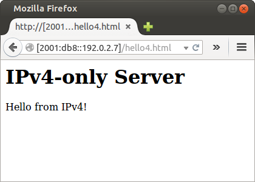
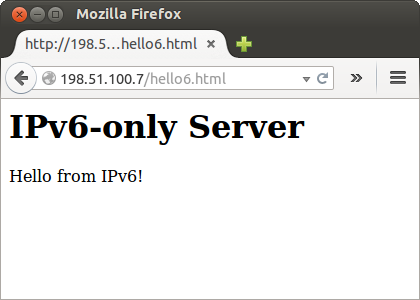

[Documentación](documentation.html) > [Ejemplos de uso](documentation.html#ejemplos-de-uso) > SIIT

# SIIT: Ejemplo de Uso

## Índice

1. [Introducción](#introduccin)
2. [Red de ejemplo](#red-de-ejemplo) 
	a) [Configuración de Nodos en IPv6](#configuracin-de-nodos-en-ipv6) 
	b) [Configuración de Nodos en IPv4](#configuracin-de-nodos-en-ipv4) 
	c) [Configuración del Nodo Traductor](#configuracin-del-nodo-traductor)
3. [Jool](#jool)
4. [Pruebas](#pruebas) 
	a) [Conectividad de IPv4 a IPv6](#conectividad-de-ipv4-a-ipv6) 
	b) [Conectividad de IPv6 a IPv4](#conectividad-de-ipv6-a-ipv4) 
	c) [Conectividad a un Web Server en IPv4](#conectividad-a-un-web-server-en-ipv4) 
	d) [Conectividad a un Web Server en IPv6](#conectividad-a-un-web-server-en-ipv6)
5. [Deteniendo Jool](#deteniendo-jool)
6. [Lecturas adicionales](#lecturas-adicionales)

## Introducción

Este documento explica cómo ejecutar Jool en modo SIIT. Si no tiene nociones de este tipo de traducción ingrese a [SIIT Tradicional](intro-nat64.html#siit-tradicional).

En cuanto a software, solamente se necesita una [instalación exitosa del módulo del kernel](mod-install.html). La aplicación de configuración queda fuera del alcance de esta página.

Para la implementación de las pruebas, puede usar alternativamente máquinas virtuales u otro tipo de interfaces, dado que Jool no está ligado al uso exclusivo de interfaces físicas del tipo "_ethX_".

## Red de ejemplo

No es necesario que de de alta todos los nodos que se muestran en el diagrama; puede lograrlo con únicamente 3 nodos: _A_, _T_ y _V_. El resto son muy similares a _A_ y _V_ y son mostrados para propósitos ilustrativos.

Considere que tiene un bloque de direcciones 198.51.100.8/29 para distribuirlo entre sus nodos IPv6.

Jool requiere que _T_ tenga instalado Linux. El resto de los nodos puede tener cualquier otro sistema operativo, siempre y cuando manejen TCP/IP.

Sin embargo para efectos de simplicidad, los ejemplos aquí mencionados asumen que todos los nodos tienen instalado Linux y que todo esta siendo configurado estáticamente usando el bien-conocido comando `ip`. Y además, todo el tráfico será redirigido por defecto hacia _T_.

Dependiendo de su distribución de linux, la forma de cómo deshabilitar el administrador de red puede variar. Precisamente en la siguiente sección, el punto de `service network-manager stop` se requiere para tomar el control sobre las direcciones y rutas de las interfaces; de otra forma, los comandos `ip` podrían no tener efecto.

### Configuración de Nodos en IPv6

Para los nodos de _A_ a _E_, ejecute la siguiente secuencia de comandos:


user@A:~# service network-manager stop
user@A:~# ip link set eth0 up
user@A:~# # Replace ".8" depending on which node you're on.
user@A:~# ip addr add 2001:db8::198.51.100.8/120 dev eth0
user@A:~# ip route add default via 2001:db8::198.51.100.1


### Configuración de Nodos en IPv4

Para los nodos de _V_ a _Z_, ejecute la siguiente secuencia de comandos:


user@V:~# service network-manager stop
user@V:~# ip link set eth0 up
user@V:~# # Replace ".16" depending on which node you're on.
user@V:~# ip addr add 192.0.2.16/24 dev eth0
user@V:~# ip route add default via 192.0.2.1


### Configuración del Nodo Traductor

Para el Nodo _T_, ejecute la siguiente secuencia de comandos con permisos de administrador:


user@T:~# service network-manager stop
user@T:~# 
user@T:~# ip link set eth0 up
user@T:~# ip addr add 2001:db8::198.51.100.1/120 dev eth0
user@T:~# 
user@T:~# ip link set eth1 up
user@T:~# ip addr add 192.0.2.1/24 dev eth1


Hasta aquí _T_ no es un traductor todavía, pues el servicio está dado de baja; por lo cual, los nodos desde _A_ hasta _E_ no pueden interactuar todavía con los nodos _V_ hasta _Z_. Pero  antes de continuar, se puede validar la comunicacion entre todos los nodos.

El siguiente paso es habilitar las banderas de forwarding de IPv4 e IPv6.


user@T:~# sysctl -w net.ipv4.conf.all.forwarding=1
user@T:~# sysctl -w net.ipv6.conf.all.forwarding=1


> **Notas:** 
> - Si usted deja desactivada estas banderas en los **kernels 3.5 o más bajos**, parecerá que todo funciona pero Linux eliminará tráfico importante de ICMP. En los kernels superiores no hay consecuencias adversas hasta la fecha reportadas. 
> - Por otro lado, considere que Jool 4.0 es muy probable que requiera la habilitación de forwarding, entonces, si lo adiciona ahora ya no requerirá añadirlo.

Adicionalmente, también se requiere apagar los offloads por medio de `ethtool`:


user@T:~# ethtool --offload eth0 tso off
user@T:~# ethtool --offload eth0 ufo off
user@T:~# ethtool --offload eth0 gso off
user@T:~# ethtool --offload eth0 gro off
user@T:~# ethtool --offload eth0 lro off
user@T:~# ethtool --offload eth1 tso off
user@T:~# ethtool --offload eth1 ufo off
user@T:~# ethtool --offload eth1 gso off
user@T:~# ethtool --offload eth1 gro off
user@T:~# ethtool --offload eth1 lro off


> **Notas:** 
> - Si los llegará a dejar prendidos entonces experimentará un performance muy bajo. 
> - Observe también, que si no puede cambiar alguno de los parámetros, es posible que ya este apagado. 
>	Ejecute `sudo ethtool --show-offload [interface]` para averiguarlo.
			 
## Jool

Esta es la sintaxis para insertar Jool SIIT en el kernel: 

	user@T:~# modprobe jool_siit \
		[pool6=<IPv6 prefix>] \
		[blacklist=<IPv4 prefixes>] \
		[pool6791=<IPv4 prefixes>] \
		[disabled]

Los parámetros válidos son:

- `pool6` (abreviación de "Pool de IPv6") es el prefijo que el mecanismo de traducción estará adjuntando y removiendo de las direcciones de los paquetes. Si planea usar EAM, este parámetro es opcional.

- `blacklist` representa direcciones IPv4 que Jool **no** va a traducir usando el prefijo pool6, por lo que esta no aplica con EAM. Puede insertar hasta cinco prefijos separados por coma durante el modprobe. Si requiere más use la [Aplicación de Configuración](usr-flags-blacklist.html).

- `pool6791` es un pool IPv4 secundario que se utiliza cuando [no hay una conexión directa entre uno o varios nodos y el traductor](rfc6791.html). Si este pool está vacío, Jool enviará la dirección propia de su nodo hacia el nodo destino. Puede insertar hasta cinco prefijos `pool6791` separados por coma durante el modprobe. Si necesita más, emplee la [Aplicación de Configuración](usr-flags-pool6791.html).

- `disabled` inicia Jool en modo inactivo. Si está utilizando el configurador, puede usar esta opción para asegurarse de que ha terminado de configurar antes de que tu tráfico empiece a ser traducido.
Si no está presente, Jool empieza a traducir el tráfico de inmediato.

Lo siguiente es sufciente para la red de ejemplo.

	user@T:~# modprobe jool_siit pool6=2001:db8::/96

Eso significa que: "La representación IPv6 de cualquier dirección IPv4 va a ser `2001:db8::<IPv4 address>`."

## Pruebas

### Conectividad de IPv4 a IPv6

Realice un ping a _A_ desde _V_ de esta forma:


user@V:~$ ping 198.51.100.8
PING 198.51.100.8 (198.51.100.8) 56(84) bytes of data.
64 bytes from 198.51.100.8: icmp_seq=1 ttl=63 time=7.45 ms
64 bytes from 198.51.100.8: icmp_seq=2 ttl=63 time=1.64 ms
64 bytes from 198.51.100.8: icmp_seq=3 ttl=63 time=4.22 ms
64 bytes from 198.51.100.8: icmp_seq=4 ttl=63 time=2.32 ms
^C
--- 198.51.100.8 ping statistics ---
4 packets transmitted, 4 received, 0% packet loss, time 3006ms
rtt min/avg/max/mdev = 1.649/3.914/7.450/2.249 ms


### Conectividad de IPv6 a IPv4

Haga un ping a _V_ desde _A_:


user@A:~$ ping6 2001:db8::192.0.2.16
PING 2001:db8::192.0.2.16(2001:db8::c000:210) 56 data bytes
64 bytes from 2001:db8::c000:210: icmp_seq=1 ttl=63 time=3.57 ms
64 bytes from 2001:db8::c000:210: icmp_seq=2 ttl=63 time=10.5 ms
64 bytes from 2001:db8::c000:210: icmp_seq=3 ttl=63 time=1.38 ms
64 bytes from 2001:db8::c000:210: icmp_seq=4 ttl=63 time=2.63 ms
^C
--- 2001:db8::192.0.2.16 ping statistics ---
4 packets transmitted, 4 received, 0% packet loss, time 3003ms
rtt min/avg/max/mdev = 1.384/4.529/10.522/3.546 ms


### Conectividad a un Web Server en IPv4

Agrege un servidor en _X_ y acceselo desde _D_:

### Conectividad a un Web Server en IPv6

Agrege un servidor en _C_ y haga una solicitud desde _W_:

Si algo no funciona, consulta el [FAQ](faq.html).

## Deteniendo Jool

Para detener Jool, emplee de nuevo el comando modprobe usando el parámetro `-r`:


user@T:~# modprobe -r jool_siit


## Lecturas adicionales

Si quiere profundizar le recomedamos leer:

1. El [argumento `pool6791`](usr-flags-pool6791.html) y su [uso](rfc6791.html).
2. Por favor, antes de seleccionar alguno MTU, lea acerca de [problemas con MTUs](mtu.html).
3. Si le interesa EAM, dirigese al [segundo ejemplo](mod-run-eam.html).
4. Si le interesa Stateful NAT64, dirigese al [tercer ejemplo](mod-run-stateful.html).
5. El [documento de DNS64](dns64.html) le dirá como configurar un DNS64 para hacer transparente el uso de dirección-prefijo a los usuarios.
