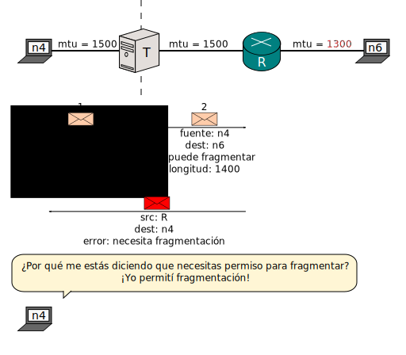
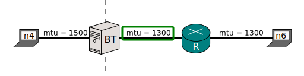

[Documentación](documentation.html) > [Otros](documentation.html#otros) > MTU y Fragmentación

# MTU y Fragmentación

## Enunciación del problema

Hay una diferencia entre IPv4 e IPv6 por la cual un traductor IP no puede compensar.

La cabecera IPv4 contiene un parámetro llamado [_Don't fragment_](http://en.wikipedia.org/wiki/IPv4#Packet_structure) (DF/No Fragmentar), que determina si el nodo fuente desea permitir a routers fragmentar en caso de que el paquete alcance un enlace por el cual no puede pasar debido a su tamaño.

En IPv6, los paquetes nunca pueden ser fragmentados por routers. Es como si DF siempre estuviera encendido.

Por lo tanto, cuando hay un traductor enmedio, un paquete IPv4 que puede ser fragmentado siempre se convierte en un paquete IPv6 que no debe ser fragmentado.

¿Qué pasa si el paquete es muy grande?

(En realidad, los tamaños reales de los paquetes cambian debido a encabezados reemplazados, pero este detalle no afecta al ejemplo.)

El resultado es definido por implementación. Si _n4_ es inteligente, tratará de reducir el tamaño del paquete paquete. Si no, el paquete nunca llegará a _n6_.

En la vida real, una implementación puesta al día no enfrenta este problema dado que utiliza [Path MTU discovery](http://en.wikipedia.org/wiki/Path_MTU_Discovery), y por lo tanto jamás desactiva DF. Sin embargo, software terco o legado no es demasiado difícil de encontrar.

Por cierto: El comando `ip` puede ser usado para conocer el MTU de un enlace:

<pre><code class="bash">$ ip link
(...)
2: eth0: &lt;BROADCAST,MULTICAST,UP,LOWER_UP&gt; <strong>mtu 1500</strong> qdisc pfifo_fast state UP mode DEFAULT group default qlen 1000
    link/ether 08:00:27:bf:a6:6e brd ff:ff:ff:ff:ff:ff
</code></pre>

## Solución

Si el MTU más pequeño a lo largo de todas las redes IPv6 es conocido, una solución es informárselo a _T_:


user@T:~/# ip link set dev eth0 mtu 1300


_T_ sabe que está traduciendo, de modo que sabe que **tiene** que fragmentar a pesar de ser un pseudo-router de IPv6.

Y voilà:

Si el MTU mínimo de las redes IPv6 no es conocido, es buena idea asignar 1280. Por estándar, todo nodo IPv6 debe ser capaz de manejar por lo menos 1280 bytes por paquete.

