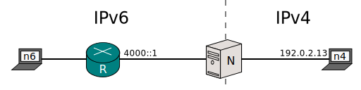

[Documentación](documentation.html) > [Ejemplos de uso](documentation.html#ejemplos-de-uso) > [SIIT](run-vanilla.html) > RFC 6791

# RFC 6791

## Índice

1. [Introducción](#introduccin)
2. [Definición del Problema](#definicin-del-problema)
3. [Ejemplo](#ejemplo)
4. [Notas Adicionales](#notas-adicionales)

## Introducción

Este documento es una introducción al RFC 6791 y a la [pool de SIIT Jool que hereda su nombre](usr-flags-pool6791.html).

En este RFC se establece la forma de cómo proveer de direcciones válidas en IPv4 a los HOPs de IPv6 en el caso de que alguno de ellos requiera reportar algún error de ICMP.

## Definición del Problema

Un traductor Stateless IPv4/IPv6 podría recibir paquetes de IPv6 que contengan direcciones **no-traducibles** a IPv4 como dirección fuente, provenientes de los enlaces entre redes. 

Se entiende por **no-traducibles** cuando se cumple estas dos condiciones:

1. Que no siga la norma establecida en el [RFC 6052, cap2.](https://tools.ietf.org/html/rfc6052#section-2),
2. Ni que esté dado de alta en la tabla EAM, ver [draft EAM, sección 3.2]({{ site.draft-siit-eam }}#section-3.2).

Si esto sucede, entonces implica que dos condiciones ocurrieron:

1. Existe al menos un ruteador entre el Nodo en IPv6 y el Traductor (Jool) antes de llegar al Nodo en IPv4.
2. El paquete es del tipo ICMPv4 Error Message.

En dichas excepciones, los paquetes deben pasar a través de _T_ a la dirección destino de IPv4 para que éste pueda tomar la acción correspondiente.

## Ejemplo

Suponga que _n4_ envía un paquete a _n6_, pero hay un problema, el mensaje es muy grande, entonces _R_ envíará un paquete de error ICMP a _n4_. Tome en consideración que _T_ está traduciendo usando el prefijo 2001:db8::/96.

El paquete de _R_ tendrá las siguientes direcciones:

| Origen  | Destino              |
|---------+----------------------|
| 4000::1 | 2001:db8::192.0.2.13 |

_T_ está en problemas porque la dirección origen del paquete no tiene el prefijo de traducción, así que no puede ser extraida una dirección IPv4 de él.

Normalmente, no se tienen muchas direcciones IPv4, así que no es razonable asignarle una a cada uno de los nodos en el lado IPv6. Debido a su único propósito (casi siempre) de redireccionamiento, los routers son buenos candidatos para direcciones no-traducibles. Por otro lado, los errores ICMP son importantes, y un NAT64 no deberia desecharlo simplemente por que viene de un router.

Un Stateful NAT64 generalmente no requiere esta pool porque [hace que todas las direcciones IPv6 sean traducibles](intro-nat64.html#stateful-nat64) (ya que todos los nodos IPv6 comparten las direcciones IPv4 del NAT64). Para solucionar el problema, un modulo SIIT debe mantener un pool de direcciones reservadas. Al recibir un error ICMP con un origen que no se puede traducir, Jool deberá asignar una dirección aleatoria obtenida de esta pool.

## Notas Adicionales

Por favor considere los siguientes extractos del [RFC 6791](https://tools.ietf.org/html/rfc6791) mientras decide el tamaño y las direcciones de su RFC 6791 pool:

	La dirección de origen utilizada NO DEBE causar que le paquete ICMP
	sea descartado. NO DEBE ser tomada del espacio de direcciones de
	[RFC1918] o de [RFC6598], ya que ese espacio de direcciones es probable
	a estar sujeto al filtrado unicast Reverse Path Forwarding (uRPF) [RFC3704].

	(...)

	Otra consideración para la seleccion del origen es que debe ser
	posible para los contenedores IPv4 del mensaje ICMP ser capaces de
	distinguir entre la diferentes posibles fuentes de los mensajes ICMPv6
	(por ejemplo, soportar una herramienta de diagnostico de traza de ruta
	que proporcione algo de visibilidad a nivel de red limitada a través del traductor
	IPv4/Pv6). Esta consideración implica que un traductor IPv4/IPv6
	necesita tener un pool de direcciones IPv4 para mapear la direccion de origen 
	de paquetes ICMPv6 generados desde origenes diferentes, o para incluir
	la información de la dirección de origen IPv6 para mapear la dirección de origen 
	por otros medios.  Actualmente, TRACEROUTE y [MTR] son los únicos
	consumidores de mensajes ICMPv6 traducidos que se interpretan la
	dirección ICMPv6 fuente.
	
	(...)

	Si un pool de direcciones públicas IPv4 está configurado en el traductor,
	se RECOMIENDA seleccionar aleatoriamente la dirección origen IPv4 del
	pool. La selección aleatoria reduce la probabilidad de que dos mensajes
	ICMP sucitados por la misma Traza De Ruta puedan especificar la misma dirección
	origen y, por consiguiente, erróneamente dar la apariencia de un bucle de ruteo.

El [Ejemplo de SIIT](run-vanilla.html) muestra cómo configurar el pool durante un modprobe. También se puede editar mediante la [Aplicación de espacio de usuario](usr-flags-pool6791.html).

