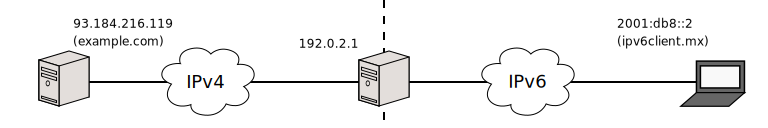

[Documentación](documentation.html) > [Aplicación de Espacio de Usuario](documentation.html#aplicacin-de-espacio-de-usuario) > `--session`

# \--session

## Índice

1. [Descripción](#descripcin)
2. [Sintaxis](#sintaxis)
3. [Opciones](#opciones)
   1. [Operaciones](#operaciones)
   2. [`<protocolos>`](#protocolos)
   3. [`--numeric`](#numeric)
   4. [`--csv`](#csv)
4. [Ejemplos](#ejemplos)

## Descripción

Las tablas de sesión son una base de datos que guardan información sobre cada conexión siendo trabajada por un NAT64.

Cada renglón tiene seis campos que describen a una sesión:

- Remote6: Dirección de transporte de la conexión del nodo de IPv6.
- Local6: Representación en IPv6 de la dirección de transporte de la conexión del nodo de IPv4.
- Local4: Dirección de transporte IPv4 que Jool está usando para enmascarar al nodo de IPv6.
- Remote4: Dirección de transporte de la conexión del nodo de IPv4.
- Protocolo: Indica si la conexión es TCP, UDP o ICMP.
- Tiempo de expiración: Tiempo de vida de la sesión. Si no se traducen paquetes relevantes en este tiempo, la sesión se considerará expirada. Esto generalmente significa que será removida de la base de datos.
- Estado: Solamente para sesiones TCP, indica la situación de la sesión según la máquina de estados definida [aquí](http://tools.ietf.org/html/rfc6146#section-3.5.2.2).

Por ejemplo,

Si _n6_ interactúa con _n4_, se puede esperar que _J_ popule la tabla con una sesión similar a la siguiente:

| Remote6          | Local6                  | Local4         | Remote4        | Protocolo | Expiración |
|------------------|-------------------------|----------------|----------------|-----------|------------|
| 2001:db8::2#1234 | 64:ff9b::203.0.113.1#80 | 192.0.2.1#1234 | 203.0.113.1#80 | UDP       | 2 min      |

Las columnas "remotas" indican los nodos que están interactuando. "Local6" es el prefijo de pool6 concatenado a Remote4, y Local4 es la dirección "local" que Jool está usando para enmascarar a _n6_.

Por cada entrada BIB existe una o más sesiones. Remote6 y Local4 siempre equivalen a las respectivas direcciones de la entrada BIB correspondiente.

Las tablas de sesiones se populan automáticamente y no tiene sentido modificarlas manualmente. Este modo de configuración es solo informativo.

## Sintaxis

	jool --session [--display] [--numeric] [--csv] <protocolos>
	jool --session --count <protocolos>

## Opciones

### Operaciones

* `--display`: Imprime las tablas de sesión en salida estándar. Esta es la operación por omisión.
* `--count`: Lista la cantidad de registros por tabla de sesión.

### `<protocolos>`

	<protocolos> := [--tcp] [--udp] [--icmp]

El comando aplica sobre la(s) tabla(s) específica(s). Si no se indica, entonces afecta a los tres protocolos.

### `--numeric`

La aplicación intentará resolver el nombre del nodo IPv6 de cada sesión. _Si los nameservers no están respondiendo, la salida se retrasará_.

`--numeric` desactiva la resolución de nombres.

### `--csv`

Por defecto, la aplicación imprime las tablas en un formato relativamente amigable para la consola.

`--csv` se puede usar para imprimir en [formato CSV](http://es.wikipedia.org/wiki/CSV), que es amigable con software de hojas de cálculo.

## Ejemplos

El cliente ipv6client.mx efectua dos solicitudes HTTP y un ping al servidor example.com en IPv4.

Para desplegar todas las sesiones activas en los tres protocolos, resolviendo nombres y con formato consola, ejecutar el siguiente comando:


$ jool --session
TCP:
---------------------------------
(V4_FIN_V6_FIN_RCV) Expires in 2 minutes, 57 seconds
Remote: example.com#http	ipv6client.mx#58239
Local: 192.0.2.1#60477		64:ff9b::5db8:d877#80
---------------------------------
(V4_FIN_V6_FIN_RCV) Expires in 3 minutes, 52 seconds
Remote: example.com#http	ipv6client.mx#58237
Local: 192.0.2.1#6617		64:ff9b::5db8:d877#80
---------------------------------
  (Fetched 2 entries.)

UDP:
---------------------------------
  (empty)

ICMP:
---------------------------------
Expires in 50 seconds
Remote: example.com#1402	ipv6client.mx#13371
Local: 192.0.2.1#1402		64:ff9b::5db8:d877#13371
---------------------------------
  (Fetched 1 entries.)


Filtrando UDP e ICMP, mostrar las IP numéricas y en salida estándar:


$ jool --session --display --tcp --numeric
TCP:
---------------------------------
(V4_FIN_V6_FIN_RCV) Expires in 2 minutes, 57 seconds
Remote: 93.184.216.119#80	2001:db8::2#58239
Local: 192.0.2.1#60477		64:ff9b::5db8:d877#80
---------------------------------
(V4_FIN_V6_FIN_RCV) Expires in 3 minutes, 52 seconds
Remote: 93.184.216.119#80	2001:db8::2#58237
Local: 192.0.2.1#6617		64:ff9b::5db8:d877#80
---------------------------------
  (Fetched 2 entries.)


Sin resolver nombres, guardar todo en formato CSV en el archivo session.csv:


$ jool --session --display --numeric --csv > session.csv


[session.csv](../obj/session.csv)

Mostrar el número de registros de todas las tablas:


$ jool --session --count
TCP: 2
UDP: 0
ICMP: 1

