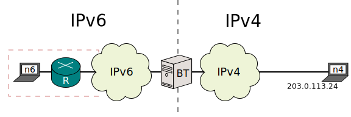
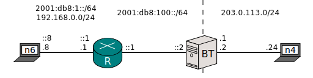
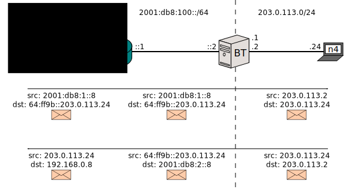
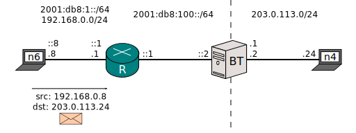
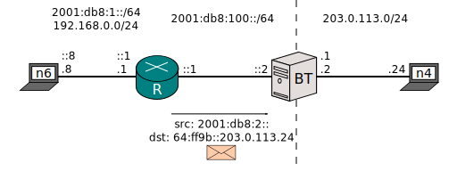
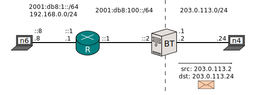
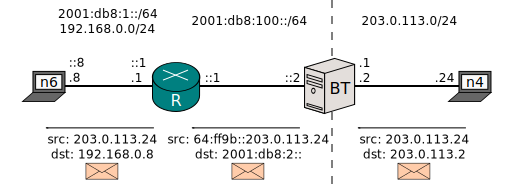

[Documentation](doc-index.html) > [Runs](doc-index.html#runs) > 464XLAT and SIIT/DC Dual Translation Mode

# 464XLAT and SIIT/DC Dual Translation Mode

## Index

1. [Introduction](#introduction)
2. [Sample Network](#sample-network)
3. [Expected Packet Flow](#expected-packet-flow)
4. [Testing](#testing)
5. [Closing words](#closing-words)
6. [Further reading](#further-reading)

## Introduction

NAT64 is not perfect. While you might see a lot of traffic getting translated quirklessly, you might eventually bump into the following rough edge:

Baring RFC 6384, NAT64 only translates network headers (IPv4, IPv6 and ICMP) and transport headers (UDP and TCP). Sometimes, this is a problem. Some protocols on top of UDP and TCP have a bad habit of including IP addresses ("IP literals") along their conversations; because NAT64 only translates lower protocols, these literals will slip past the NAT64 unmodified.

For example, some IPv6-unaware website, which would normally contain this HTML:

	<a href="www.jool.mx/index.html">Link to something.</a>

Could be poorly coded like this:

	<a href="203.0.113.24/index.html">Link to something.</a>

This address lies within the body of an HTML file, not a network or transport header. It is not viable for Jool to support translation of all existing application protocols.

If you click the latter version of the link from an IPv6-only node via a NAT64, it will of course not work, because the node doesn't have an IPv4 stack with which to access `203.0.113.24`. `www.jool.mx` works fine because the DNS64 appends the NAT64 prefix once the node asks about it; on the other hand, if all the node has is `203.0.113.24`, it can't really tell it's talking via a NAT64, much less know which prefix should be appended.

[464XLAT](https://tools.ietf.org/html/rfc6877) is a technique meant to address this limitation. It functions by appending another NAT64 into the mix, that reverses the work made by the already existing NAT64. The idea can be generalized to also provide Internet to IPv4-only services when all you have is an IPv6 address space, which is [SIIT/DC: Dual Translation Mode](https://tools.ietf.org/html/draft-ietf-v6ops-siit-dc-2xlat-00).

This document is a dumbed-down summary of both of these techniques, collapsed into a walkthrough that uses Jool.

## Sample Network

The red box would be your domain. _n6_ stands for "IPv6 node" and _R_ is "router". Say your ISP gives you only IPv6 addresses, but it also grants you access to IPv4 via a stateful NAT64 (_BT_; "Border Translator"). _n4_ is a random IPv4 Internet node.

Say your user from _n6_ clicks a link towards `203.0.113.24`. _n6_ does not have an IPv4 stack, so the request has nowhere to go. The situation could be amended by manually appending the NAT64 prefix to the address, but the user doesn't know that. Of course, a DNS64 would be the ideal and transparent solution, but unfortunately the site provided an address and not a domain name, so _n6_ is not querying the DNS.

Alternatively, _n6_ might want to provide a legacy service (or client) which is unfortunately tied to IPv4. Because _n6_ only has global IPv6 addresses, it appears it cannot do so.

In broad terms, the solution is to provide _n6_ with a "fake" IPv4 stack whose packets will be NAT64'd into IPv6 before reaching _BT_. In other words, there will be two NAT64s, and they will be sort of undoing each other's work.

There are rather several ways to do this. Unfortunately, one of them ([putting a NAT64 within _n6_](https://tools.ietf.org/html/draft-ietf-v6ops-siit-dc-2xlat-00#section-3.1)) is rather embarrassingly not yet implemented by Jool. One that does work is to put the NAT64 within _R_. The network would look like this:

I also removed the clouds to simplify routing in the example. The dual translation idea has really nothing to do with routing, so this is unimportant.

## Expected Packet Flow

This is the normal flow an IPv6-sourced packet would traverse. It's a typical stateful NAT64 flow and the Dual Translation presented in this configuration will not interfere with it: Notice we've chosen 64:ff9b::/96 as _BT_'s NAT64 prefix:

The 464XLAT flow we want to achieve follows. _n6_ will use its IPv4 address to try to query the literal (or whatever IPv4 Internet address):

_R_ will NAT64 the packet into IPv6 so it can traverse the IPv6-only chunk. Address 192.168.0.8 will be translated using the EAMT entry, and 203.0.113.24 will receive the NAT64 prefix treatment.

_BT_ will do its magic and send the packet to the IPv4 Internet:

And the mangling will be mirrored for the response:

## Configuration

_n6_ doesn't know it kind of owns another IPv6 address in the 2001:db8:2::/96 network. It never sees this traffic, because _R_ always translates it towards 192.0.2.0/24.

	sudo service network-manager stop

	sudo ip link set eth0 up
	sudo ip addr add 2001:db8:1::8/64 dev eth0
	sudo ip addr add 192.168.0.8/24 dev eth0

	sudo ip route add default via 2001:db8:1::1
	sudo ip route add default via 192.168.0.1

This is _R_:

	sudo service network-manager stop

	sudo ip link set eth0 up
	sudo ip addr add 192.168.0.1/24 dev eth0
	sudo ip addr add 2001:db8:1::1/64 dev eth0

	sudo ip link set eth1 up
	sudo ip addr add 2001:db8:100::1/64 dev eth1

	# Traffic headed to the real IPv4 Internet goes via BT.
	sudo ip route add 64:ff9b::/96 via 2001:db8:100::2

	# Enable routerness.
	sudo sysctl -w net.ipv6.conf.all.forwarding=1
	sudo sysctl -w net.ipv4.conf.all.forwarding=1

	# Enable Stateless NAT64.
	# We're masking the private network using an EAMT entry.
	# Traffic towards the Internet (0.0.0.0/0 ie. anything) is to be appended BT's prefix.
	# Recall that the EAMT has higher precedence than the NAT64 (pool6) prefix.
	sudo modprobe jool_stateless pool6=64:ff9b::/96 pool4=0.0.0.0/0 errorAddresses=192.168.0.128/25
	sudo jool_stateless --eamt --add 192.168.0.8/29 2001:db8:2::/125

_n6_'s packet will have addresses `192.168.0.8` and `203.0.113.24`. The former will be translated using the EAMT entry (since it matches `192.168.0.8/29`) and the latter will use the pool6 prefix (because it matches `0.0.0.0/0`). We're using `0.0.0.0/0` because we're talking about the whole Internet.

Also note that _R_ is an average NAT64 and you shouldn't think of this installation of Jool as anything other than that.

For completeness sake, here's _BT_'s network configuration:

	sudo service network-manager stop

	sudo ip link set eth0 up
	sudo ip addr add 2001:db8:100::2/64 dev eth0
	# I'm pretending the ISP gave us these two prefixes to play with.
	sudo ip route add 2001:db8:1::/64 via 2001:db8:100::1
	sudo ip route add 2001:db8:2::/64 via 2001:db8:100::1

	sudo ip link set eth1 up
	sudo ip addr add 203.0.113.1/24 dev eth1
	sudo ip addr add 203.0.113.2/24 dev eth1

	sudo modprobe jool_stateful pool6=64:ff9b::/96 pool4=203.0.113.2

And _n4_ is thoroughly boring:

	sudo service network-manager stop

	sudo ip link set eth0 up
	sudo ip addr add 203.0.113.24/24 dev eth0
	sudo ip route add default via 203.0.113.2

## Testing

Ping _n4_ via IPv4 from _n6_:

	$ ping 203.0.113.24 -c 1
	PING 203.0.113.24 (203.0.113.24) 56(84) bytes of data.
	64 bytes from 203.0.113.24: icmp_seq=1 ttl=62 time=4.13 ms

	--- 203.0.113.24 ping statistics ---
	1 packets transmitted, 1 received, 0% packet loss, time 0ms
	rtt min/avg/max/mdev = 4.130/4.130/4.130/0.000 ms

- [ipv4-n6.pcapng](obj/464xlat/ipv4-n6.pcapng)
- [ipv4-r.pcapng](obj/464xlat/ipv4-r.pcapng)
- [ipv4-bt.pcapng](obj/464xlat/ipv4-bt.pcapng)
- [ipv4-n4.pcapng](obj/464xlat/ipv4-n4.pcapng)

Ping _n4_ via IPv6 from _n6_:

	$ ping6 64:ff9b::203.0.113.24 -c 1
	PING 64:ff9b::203.0.113.24(64:ff9b::cb00:7118) 56 data bytes
	64 bytes from 64:ff9b::cb00:7118: icmp_seq=1 ttl=62 time=14.0 ms

	--- 64:ff9b::203.0.113.24 ping statistics ---
	1 packets transmitted, 1 received, 0% packet loss, time 0ms
	rtt min/avg/max/mdev = 14.053/14.053/14.053/0.000 ms

- [ipv6-n6.pcapng](obj/464xlat/ipv6-n6.pcapng)
- [ipv6-r.pcapng](obj/464xlat/ipv6-r.pcapng)
- [ipv6-bt.pcapng](obj/464xlat/ipv6-bt.pcapng)
- [ipv6-n4.pcapng](obj/464xlat/ipv6-n4.pcapng)

## Closing words

Though at this point you can see how you can defend yourself against IP literals and legacy IPv4-only appliances, you might want to be forewarned that at least [one application protocol](http://tools.ietf.org/html/rfc959) out there is so poorly designed it works differently depending on whether it's sitting on top of IPv6 or IPv4. Therefore, [addressing IP literals in this case is not sufficient to make it work via NAT64](https://github.com/NICMx/NAT64/issues/114).

On the other hand, some network-aware protocols only partially depend on literals, and the NAT64 is not going to get in the way of the features that don't. FTP's passive mode falls in this category.

Here's a list of protocols that are known to use IP literals. You might also want to see [RFC 6586](http://tools.ietf.org/html/rfc6586).

 - FTP (try passive mode)
 - Skype
 - NFS
 - Google Talk Client *
 - AIM (AOL)
 - ICQ (AOL)
 - MSN
 - Webex
 - [Some games](http://tools.ietf.org/html/rfc6586#section-5.4)
 - [Spotify](http://tools.ietf.org/html/rfc6586#section-5.5)
 - [Poorly coded HTML](http://tools.ietf.org/html/rfc6586#section-6.1)

## Further reading

- [464XLAT](https://tools.ietf.org/html/rfc6877)
- [SIIT/DC: Dual Translation Mode](https://tools.ietf.org/html/draft-ietf-v6ops-siit-dc-2xlat-00)

