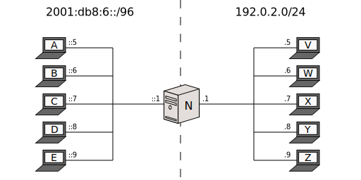
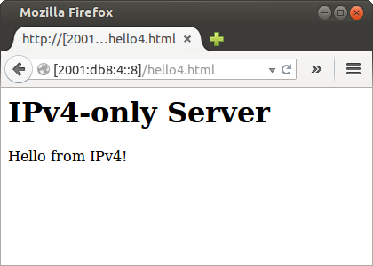
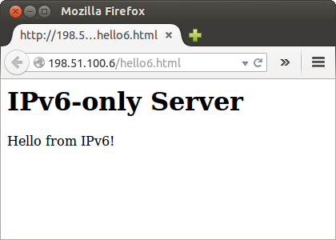

[Documentation](doc-index.html) > [Runs](doc-index.html#runs) > Stateless NAT64 + EAM

# EAM Run

## Index

1. [Introduction](#introduction)
2. [Sample Network](#sample-network)
3. [Jool](#jool)
4. [Testing](#testing)
5. [Stopping Jool](#stopping-jool)
6. [Further reading](#further-reading)

## Introduction

This document explains how to run Jool in [EAM mode](intro-nat64.html#stateless-nat64-with-eam) (which actually more than a "mode" is simply stock stateless with records on the EAM table). Follow the link for more details on what to expect.

[Stock mode](mod-run-vanilla.html) is faster to configure and you're encouraged to learn it before, particularly because I will not ellaborate here on the steps which both modes have in common. Software-wise, you need a successful installation of both the [kernel module](mod-install.html) and the [userspace application](usr-install.html) for EAM.

## Sample Network

All the remarks in the previous document's [Sample Network section](mod-run-vanilla.html#sample-network) apply here.

This is nodes _A_ through _E_:


user@A:~# service network-manager stop
user@A:~# /sbin/ip link set eth0 up
user@A:~# # Replace "::5" depending on which node you're on.
user@A:~# /sbin/ip addr add 2001:db8:6::5/96 dev eth0
user@A:~# /sbin/ip route add default via 2001:db8:6::1


Nodes _V_ through _Z_ have the exact same configuration from the previous document.


user@V:~# service network-manager stop
user@V:~# /sbin/ip link set eth0 up
user@V:~# # Replace ".5" depending on which node you're on.
user@V:~# /sbin/ip addr add 192.0.2.5/24 dev eth0
user@V:~# /sbin/ip route add default via 192.0.2.1


Node _N_:


user@N:~# service network-manager stop
user@N:~# 
user@N:~# /sbin/ip link set eth0 up
user@N:~# /sbin/ip addr add 2001:db8:6::1/96 dev eth0
user@N:~# 
user@N:~# /sbin/ip link set eth1 up
user@N:~# /sbin/ip addr add 192.0.2.1/24 dev eth1
user@N:~# /sbin/ip addr add 192.0.2.2/24 dev eth1
user@N:~# 
user@N:~# sysctl -w net.ipv4.conf.all.forwarding=1
user@N:~# sysctl -w net.ipv6.conf.all.forwarding=1
user@N:~# 
user@N:~# ethtool --offload eth0 tso off
user@N:~# ethtool --offload eth0 ufo off
user@N:~# ethtool --offload eth0 gso off
user@N:~# ethtool --offload eth0 gro off
user@N:~# ethtool --offload eth0 lro off
user@N:~# ethtool --offload eth1 tso off
user@N:~# ethtool --offload eth1 ufo off
user@N:~# ethtool --offload eth1 gso off
user@N:~# ethtool --offload eth1 gro off
user@N:~# ethtool --offload eth1 lro off


Remember you might want to cross-ping _N_ vs everything before continuing.

## Jool


user@N:~# /sbin/modprobe jool_stateless pool4=192.0.2.2 disable
user@N:~# jool_stateless --eam --add 2001:db8:6::/120 198.51.100.0/24
user@N:~# jool_stateless --eam --add 2001:db8:4::/120 192.0.2.0/24
user@N:~# jool_stateless --enable


Unlike `pool6`, it is not practical to insert the EAM table in a single command, so we instruct Jool to start disabled. We then insert the EAM table rows, one by one, using the userspace application. When the table is complete, we tell Jool it can start translating traffic (`--enable`).

Using `disable` and `--enable` is not actually neccesary; Jool will naturally figure out that it cannot translate traffic until the EAM table and/or the IPv6 pool are populated. The reason why Jool was "forced" to remain disabled until the table was complete was so there wouldn't be a timespan where traffic was being translated inconsistently (ie. with a half-complete table).

And again, the IPv6 prefix and the EAM table are not exclusive operation modes. Jool will always try to translate an address using EAM, and if that fails, fall back to using the prefix. Add `pool6` during the `modprobe` if you want this.

## Testing

If something doesn't work, try the [FAQ](misc-faq.html).

Try to ping _V_ from _A_ like this:


user@A:~$ ping6 2001:db8:4::5
PING 2001:db8:4::5(2001:db8:4::5) 56 data bytes
64 bytes from 2001:db8:4::5: icmp_seq=1 ttl=63 time=1.94 ms
64 bytes from 2001:db8:4::5: icmp_seq=2 ttl=63 time=2.16 ms
64 bytes from 2001:db8:4::5: icmp_seq=3 ttl=63 time=5.04 ms
64 bytes from 2001:db8:4::5: icmp_seq=4 ttl=63 time=3.64 ms
^C
--- 2001:db8:4::5 ping statistics ---
4 packets transmitted, 4 received, 0% packet loss, time 3002ms
rtt min/avg/max/mdev = 1.944/3.196/5.040/1.250 ms


Then ping _A_ from _V_:


user@V:~$ ping 198.51.100.5
PING 198.51.100.5 (198.51.100.5) 56(84) bytes of data.
64 bytes from 198.51.100.5: icmp_seq=1 ttl=63 time=1.19 ms
64 bytes from 198.51.100.5: icmp_seq=2 ttl=63 time=3.72 ms
64 bytes from 198.51.100.5: icmp_seq=3 ttl=63 time=4.39 ms
64 bytes from 198.51.100.5: icmp_seq=4 ttl=63 time=4.25 ms
^C
--- 198.51.100.5 ping statistics ---
4 packets transmitted, 4 received, 0% packet loss, time 3008ms
rtt min/avg/max/mdev = 1.197/3.393/4.394/1.292 ms


How about hooking up a server in _Y_ and access it from _E_:

Then maybe another one in _B_ and request from _X_:

## Stopping Jool

Same as in the [previous walkthrough](mod-run-vanilla.html#stopping-jool).

## Further reading

- Stateful NAT64 is [over here](mod-run-stateful.html).

