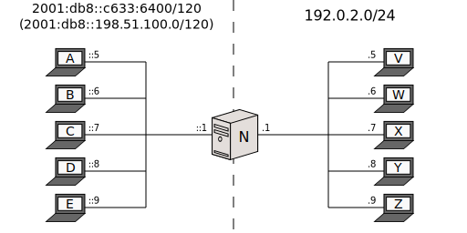

[Documentation](doc-index.html) > [Runs](doc-index.html#runs) > Stateless NAT64

# Basic Stateless Run

## Index

1. [Introduction](#introduction)
2. [Sample Network](#sample-network)
3. [Jool](#jool)
4. [Testing](#testing)
5. [Stopping Jool](#stopping-jool)
6. [Further reading](#further-reading)

## Introduction

This document explains how to run Jool in [stateless vanilla mode](intro-nat64.html#stateless-nat64-vanilla). Follow the link for more details on what to expect.

Software-wise, only a [successful install of Jool’s kernel module](mod-install.html) is required. The userspace application is out of the scope of this document on purpose.

In case you're wondering, you can follow along these tutorials using virtual machines or alternate interface types just fine (Jool is not married to physical "_ethX_" interfaces).

## Sample Network

You don't need all the nodes shown in the diagram to follow along; you can get away with only _A_, _N_ and _V_; the rest are very similar to _A_ and _V_ and are shown for illustrative purposes only.

Jool requires _N_ to be Linux. The rest can be anything you want, so long as it implements the network protocol it's connected to. Also, you are free to configure the networks using any manager you want.

For the sake of simplicity however, the examples below assume every node is Linux and everything is being configured statically using the well-known `ip` command (and friends). Depending on your distro, your mileage might vary on how to get the network manager out of the way (assuming that's what you want). Just to clarify, the point of the instruction `service network-manager stop` is to claim control over your interface addresses and routes (otherwise the `ip` commands might be ineffectual).

In order to simplify things, routing will be reduced to default all unknown traffic towards _N_. Note that there is nothing martian about anyone's configuration otherwise.

This is nodes _A_ through _E_:


user@A:~# service network-manager stop
user@A:~# # Replace ".5" depending on which node you're on.
user@A:~# ip addr add 2001::db8::198.51.100.5/120 dev eth0
user@A:~# ip route add default via 2001::db8::198.51.100.1


Nodes _V_ through _Z_:


user@V:~# service network-manager stop
user@V:~# # Replace ".5" depending on which node you're on.
user@V:~# ip addr add 192.0.2.5/24 dev eth0
user@V:~# ip route add default via 192.0.2.1


Node _N_:


user@N:~# service network-manager stop
user@N:~# ip addr add 2001::db8::198.51.100.1/120 dev eth0
user@N:~# ip addr add 192.0.2.1/24 dev eth1
user@N:~# ip addr add 192.0.2.2/24 dev eth1
user@N:~# sysctl -w net.ipv4.conf.all.forwarding=1
user@N:~# sysctl -w net.ipv6.conf.all.forwarding=1


Because we haven't turned _N_ into a NAT64 yet, nodes _A_ through _E_ still cannot interact with _V_ through _Z_, but you might want to make sure _N_ can ping everyone before continuing.

The only caveat you need to keep in mind before inserting Jool (or dealing with IPv6 in general) is that enabling forwarding in Linux does **not** automatically get you rid of offloads. Offloading is a _leaf_ node feature, otherwise a bug, and therefore it's important to turn it off on all routers. [Read this document](misc-offloading.html) if you want details.

Do that by means of `ethtool`:


user@N:~# ethtool --offload eth0 tso off
user@N:~# ethtool --offload eth0 ufo off
user@N:~# ethtool --offload eth0 gso off
user@N:~# ethtool --offload eth0 gro off
user@N:~# ethtool --offload eth0 lro off
user@N:~# ethtool --offload eth1 tso off
user@N:~# ethtool --offload eth1 ufo off
user@N:~# ethtool --offload eth1 gso off
user@N:~# ethtool --offload eth1 gro off
user@N:~# ethtool --offload eth1 lro off


(If it complains it cannot change something, keep in mind it can already be off; run `sudo ethtool --show-offload [interface]` to figure it out.)

## Jool

This is the insertion syntax:


user@N:~# /sbin/modprobe jool_stateless pool6=<IPv6 prefix> pool4=<IPv4 prefix(es)>


> **Warning!**
> 
> Notice `jool_stateless`. The binary used to be named just `jool` when stateless mode used to not be supported.
> 
> If you issue `jool` and it succeeds, you're probably inserting the old version.

These are the arguments:

- `pool6` is the prefix the translation mechanism will be appending and removing from the addresses of the packets. You might also want to keep in mind that more or less as a consequence, Jool will not attempt to translate incoming IPv6 packets whose destination addresses do not contain this prefix.
- As for `pool4`, Jool will _only_ attempt to translate incoming IPv4 packets whose destination addresses contain one of these (comma-separated) prefixes.  
Keep in mind that _N_ might need to answer ARP requests for these addresses, so you also need to have added them using `ip` (see _N_'s configuration above).  
In simple installations you only really need to enter a single address here.

In our sample network, that translates into


user@N:~# /sbin/modprobe jool_stateless pool6=2001:db8::/96 pool4=192.0.2.2


(The pool4 prefix length defaults to /32.)

TODO - pool4 en el diagrama...

## Testing

If something doesn't work, try the [FAQ](misc-faq.html).

Try to ping _V_ from _A_ like this:


user@V:~# ping6 2001:db8::192.0.2.5


Then ping _A_ from _V_:


user@A:~# ping 198.51.100.5


How about hooking up a server in _X_ and access it from _D_:

TODO

## Stopping Jool

To shut down Jool, revert the modprobe using the `-r` flag:


user@N:~# /sbin/modprobe -r jool_stateless


## Further reading

Here are some logical follow-ups if you want to read more:

- If you care about EAM, head to the [second run](mod-run-eam.html).
- If you care about stateful NAT64, head to the [third run](mod-run-stateful.html).
- The [DNS64 document](op-dns64.html) will tell you how to make the prefix-address hack transparent to users.

