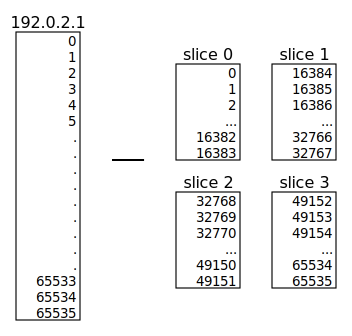
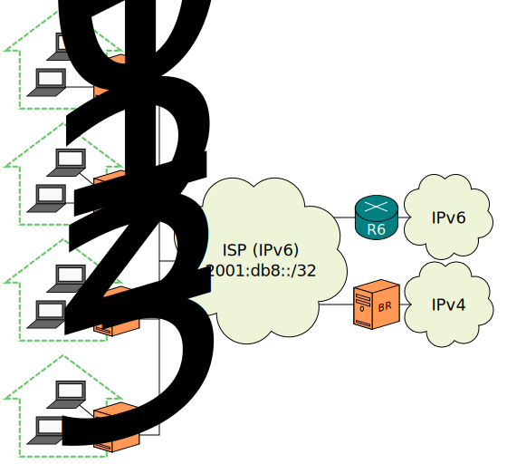
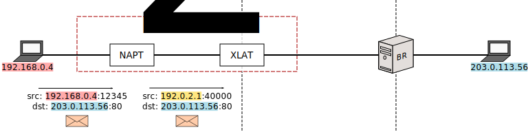
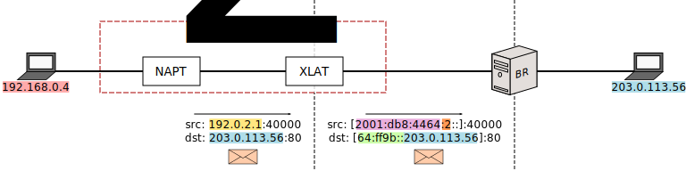

[Documentation](documentation.html) > [Introduction](documentation.html#introduction) > What is SIIT/NAT64?

# Introduction to IPv4/IPv6 Translation

## Index

1. [Introduction](#introduction)
2. [IPv4/IPv6 Translation](#ipv4ipv6-translation)
   1. [SIIT with EAM](#siit-with-eam)
   2. [SIIT (traditional)](#siit-traditional)
   3. [Stateful NAT64](#stateful-nat64)

## Introduction

This document provides a general introduction to SIIT and NAT64.

It only focuses on what, exactly, IPv4/IPv6 translators do. If you're more interested in down-to-earth setups which apply these ideas, try [Defined Architectures](documentation.html#defined-architectures).

## IPv4/IPv6 Translation

SIIT (_Stateless IP/ICMP Translation_) and NAT64 ("NAT six four", not "NAT sixty-four") are technologies meant to communicate networking nodes which only speak [IPv4](http://en.wikipedia.org/wiki/IPv4) with nodes that only speak [IPv6](http://en.wikipedia.org/wiki/IPv6).

- SIIT mangles packets, simply replacing IPv4 headers and IPv6 headers.
- _Stateful NAT64_ (or "NAT64" for short) is a combination between an SIIT and a (theoretical) IPv6 NAT; the point is to mask several IPv6 nodes behind a few IPv4 addresses.

In their basic forms, SIIT only helps communicating nodes speaking different protocols, while NAT64 also helps with [IPv4 address exhaustion](http://en.wikipedia.org/wiki/IPv4_address_exhaustion) (at the cost of being more computationally expensive and generally hindering end-to-end transparency).

Some people label SIIT as "Stateless NAT64". We don't, but we won't bite if you do.

That's all, really. Keep reading for more detail and examples.

## SIIT with EAM

This is the easiest one to explain. Consider the following setup:

(_T_ stands for "Translator".)

Assuming everyone's default gateway is _T_, how do you communicate _A_ (IPv6) with _V_ (IPv4)?

- You tell _T_, "The IPv4 address of _A_ should be 198.51.100.8, and the IPv6 address of _V_ should be 2001:db8:4::16".
- You tell _A_, "_V_'s address is 2001:db8:4::16".
- You tell _V_, "_A_'s address is 198.51.100.8".

This will happen:

The translator is "fooling" each node into thinking the other one can speak their language.

"EAM" stands for "Explicit Address Mapping", and is more versatile than simply binding arbitrary addresses to other arbitrary addresses. See the [EAM RFC]({{ site.draft-siit-eam }}) or [our summary of it](eamt.html) for more information.

## SIIT (traditional)

The basic form of SIIT is more constrictive. As a consequence, we need to change the sample IPv6 network:

The idea is to simply remove a prefix while translating from IPv6 to IPv4, and append it in the other direction:

Of course, this means each node's IPv4 address has to be encoded inside its IPv6 address, which is a little annoying.

While this explanation might make it seem like "EAM" SIIT and "traditional" SIIT are different things, this is not the case. Implementations are expected to always try to translate an address based on the EAM table first, and if no mapping is found, fall back to append or remove the prefix. The separation was done here for illustrative purposes only.

SIIT is defined by [RFC 7915]({{ site.rfc-siit }}). The address translation hack has more ways to embed the IPv4 address not shown here, and is fully defined by [RFC 6052](http://tools.ietf.org/html/rfc6052). Whenever RFC 6052 is involved, it's usually convenient to also have a [DNS64](dns64.html) so users don't need to be aware of the prefix.

[SIIT-DC](siit-dc.html) is an architecture that uses both SIIT "modes" in concert to achieve a scalable IPv4/IPv6 coexistence setup for Data Centres.

## Stateful NAT64

This mode is more akin to what people understand as "NAT" (though, more specifically, it's [NAPT](https://tools.ietf.org/html/rfc2663#section-4.1.2)). As such, allow me to remind you the big picture of how (stateful) NAT operates:

The left network is called "Private" because it uses [addresses unavailable in the global Internet](http://en.wikipedia.org/wiki/Private_network). To make up for this, _NAT_ mangles packet addresses so outsiders think any traffic started by the private nodes was actually started by itself:

As a result, for outside purposes, nodes _A_ through _E_ are "sharing" _NAT_'s global address (or addresses).

The price of being able to condense the addresses of several nodes into the ones from a single one is state. The address of the hidden node is completely deleted from the packet, therefore _NAT_ has to remember it so it can tell who the answer should be forwarded to.

These are two drawbacks that should be considered:

- The mappings/masks are limited by availability (transport addresses) and/or memory. In other words, _NAT_ is a potential DoS attack victim.
- _V_ cannot **start** a packet stream to _A_, because _NAT_ cannot infer a destination from a packet that hasn't been previously masked (and therefore, can't be remembered). NAT assumes most communication will be started from the private network.

Stateful NAT64 is pretty much the same. The only difference is that the "Private Network" is actually an IPv6 network:

This is what you tell to each node:

- _A_ needs to think _V_'s address is 64:ff9b::203.0.113.16.
- T needs a function that will use its own addresses to mask _A_, and also pretend that the IPv4 Internet is a network named 64:ff9b::/96.
- _V_ thinks it's talking to _T_, so it doesn't need any unusual tweaking.

Now, that's where the similarities with NAT end. You don't normally say the IPv6 network is "Private", because the whole point is that it should also be connected to the IPv6 Internet:

In this way, _A_ through _E_ are _IPv6-only_ nodes, but they have access to both Internets (the IPv6 one via router _R_, and the IPv4 one via _T_).

Stateful NAT64 is defined by [RFC 6146](http://tools.ietf.org/html/rfc6146) and is most of the time coupled with [DNS64](dns64.html).

## MAP-T

<!-- https://github.com/NICMx/Jool/blob/265a4d24b6639ab262a5e48596d9fc0350066e35/en/intro-xlat.md -->

(Note: This is an oversimplification meant as a general introduction. The terminology is particularly botched because I'm not a fan of the official one. Please read the MAP-T tutorial to learn more.)

Suppose you're an Internet Service Provider (ISP) with 4 customers, but you only have one IPv4 address free to distribute among them.

The idea of MAP-T is to "subdivide" your IPv4 address in equal slices, and give each slice to a separate customer. (And make everything else pure IPv6.)

How do you "subdivide" an IPv4 address? By remembering that each address has 65536 ports per transport protocol:

Of course, it's not possible to physically assign a slice of an IPv4 address to a node, and that's where the MAP translators come in:

Customer Edges (CEs) and Border Relays (BRs) will, as usual, make sure everyone is unknowingly speaking the protocol everyone else wants to hear.

- CEs are tasked with ensuring that its clients never use an IPv4 address/port outside of its assigned slice (which is simply accomplished by a NAPT), and to perform IP/ICMP translation. The "slice identifier" is encoded in the CE's IPv6 address, which is how you route a slice to its respective CE.
- BR only translates.

Here's an example:

Suppose we've decided to reserve subnetwork 2001:db8:4464::/48 for CE usage, and we're using 64:ff9b::/96 to mask the IPv4 Internet as usual. Client 192.168.0.4 is behind the CE who owns slice 2 (ports 32768-49151), and wants to send a packet to IPv4 Internet HTTP server 203.0.113.56.

The packet first gets NAT'ted from a private IPv4 transport address into a random public IPv4 transport address that can be used by the CE.

The packet is then properly MAP-T'd. The source address contains the CE's slice identifier, and the destination address is pool6'd as usual.

(By the way: I'm lying. The address format used to translate the source is significantly more complicated than that, but you get the point. It contains the "CE prefix" and the slice ID, and everything else is fluff.)

The BR mirrors the translation part of what the CE did, but not the NAPT part.

The server responds. The BR applies the appropriate transformation to each address.

You might be wondering: Since all CEs technically own address 192.0.2.1, how does the BR know that the intended CE is 2, and not one of the others?

Because, by configuration, the BR knows that port 40000 belongs to slice 2.

Things end by continuing to happen in reverse.

Of course, while MAP-T is a technique primarily preoccupied with transferring IPv4 traffic through an IPv6 backbone, there's nothing stopping you from also assigning IPv6 addresses to your customers, and have that traffic routed normally.

As you might have noticed MAP-T is most similar to 464XLAT. While 464XLAT relies on a Stateful NAT64 as the IPv4 Internet door, MAP-T uses stateless translators exclusively. In 464XLAT, the PLAT creates mappings on demand, while MAP-T has those allocations predefined ("pre-sliced") by configuration.

| 464XLAT | MAP-T |
|---------|-------|
| You might be forced to perform BIB/Session logging by your government. | No need to perform BIB/Session logging, because all mappings are predefined by configuration. |
| The PLAT assigns public transport addresses to customers on demand. (Customers needing lots of public transport addresses will get more than those who need few.) | Everyone is assigned the same number of public transport addresses. |
| One customer can perform DoS to other customers by exhausting the PLAT's public transport address pool. | One customer cannot steal other customers' public transport addresses because they're all preallocated by configuration. |

