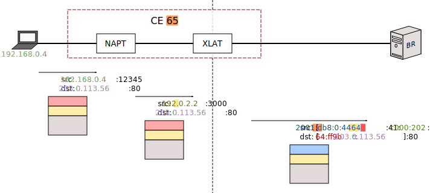
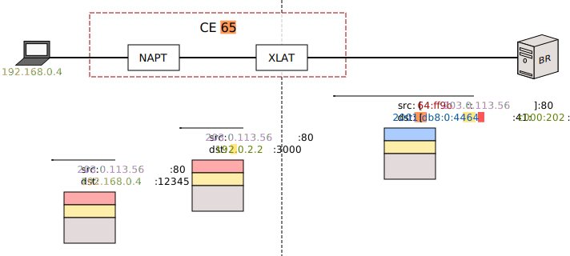
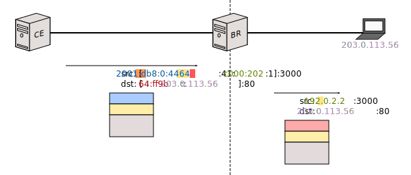
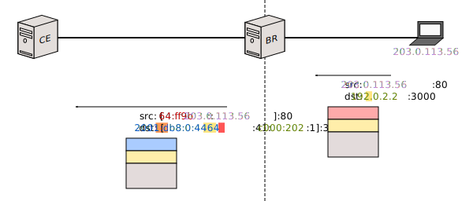

# MAP-T

## Index

1. [Introduction](#introduction)
2. [Foreword](#foreword)
2. [Thought Process](#thought-process)
3. [The MAP Address Format](#the-map-address-format)
	1. [End-user IPv6 Prefix](#end-user-ipv6-prefix)
	2. [Rule IPv6 Prefix](#rule-ipv6-prefix)
	3. [EA-bits](#ea-bits)
	4. [Subnet ID](#subnet-id)
	5. [Interface ID](#interface-id)
	6. [16 bits](#16-bits)
	7. [IPv4 address](#ipv4-address)
	8. [PSID](#psid)
4. [CE Configuration](#ce-configuration)
5. [CE Behavior](#ce-behavior)
6. [BR Configuration](#br-configuration)
7. [BR Behavior](#br-behavior)
8. [Additional Configuration](#additional-configuration)

## Introduction

This document is a layman's (but exhaustive) slightly sardonic explanation of MAP-T. It is intended to serve as a replacement for RFC 7599, or at least, as preparatory reading for it. **I'm assuming you've already consumed the [general introduction to the topic](intro-xlat.html#map-t), so you know what you're getting into.**

>  **This page is still under construction. It's bound to change. Do not use it as reference.**

A word of caution: MAP-T as an idea is the outcome of several years worth of experience with IP translation. It's several things going on at the same time, and not many of them make much sense in isolation. Sit down, grab a cup of coffee and relax. You're probably going to be here for a while.

## Foreword

The MAP RFCs argue that, depending on how many IPv4 addresses you have, and how many you're willing to assign to each CE, there are three different MAP-T scenarios:

1. You have less IPv4 addresses than CEs, so your CEs will have to share IPv4 addresses.
2. You have the same number of IPv4 addresses as CEs, so each CE will have one IPv4 address.
3. You have more IPv4 addresses than CEs, thus you can assign more than one IPv4 address to each CE.

In my opinion, the first one is the only one that truly makes sense. (If you have that many IPv4 addresses, I think it'd be more straightforward to just add NAPTs to a SIIT-DC-2xlat scenario. Way simpler than dealing with MAP-T.) To simplify this document, most of it will assume you're dealing with scenario 1.

But there's nothing in Jool stopping you from using it to assemble scenarios 2 and 3. (All you have to do is reduce the PSID length to zero. The PSID will be explained later.)

<!--
>  The first is actually the only one I described in the general introduction. (In my opinion, it's the one that makes the most sense. Not that the others don't.)

The reason why I'm explaining this is to segue into the notion that the CE identifier is not an accidental number you can arbitrarily assign, but rather, the concatenation of two crucial pieces of CE configuration you have to design: The _Full or partial IPv4 address_ (which identifies the IPv4 address assigned to the CE) and the _Port Set IDentifier_ (which, needless to say, identifies the Port Set assigned to the CE). They are explained thus:
-->

## Thought Process

In order to define your MAP-T network, you first need a general idea of how you're going to distribute your available public transport addresses.

Suppose you have the entirety of block 192.0.2.0/24 to distribute among your CEs. Suppose, as well, that you have 5000 customers.

Considering that the size of your IPv4 address pool is 256 (because of "/24"), with a simple division (ceiling of (customers divided by pool size)) you will conclude that you need to fit 20 customers per address.

Therefore, each address needs to be divided into 20 "Sets" of ports. (But MAP-T likes powers of two, so we'll have to round that up to 32.) We will assing each set to a different customer, and leftovers will be reserved for a future growth of our customer pool or whatever.

>  The following paragraph assumes `a = 0` and `m = 11`. Don't worry about this for now; `a` and `m` will be explained later.

So, we will divide each address into 32 sets of 2048 ports each (65536 / 32). The first set consists of ports 0-2047, the second set has 2048-4095, the third set has 4096-6143, and so on. The last set has 63488-65535.

With that in mind, I would like to introduce the notion of _Embedded Address bits_ ("EA-bits"). It's basically a CE identifier. (Each CE has a different one, except in scenario 3, in which every CE has several, but they're still unique.) It's composed of a concatenation of the suffix of the IPv4 address that has been assigned to the CE, as well as the identifier of its Port Set. In our example, we would need 8 bits for the suffix and 5 bits for the _Port Set IDentifier_ (PSID):

>  The general introduction used to refer to EA-bits as "slice ID."

>  Only scenario 1 includes PSID. Port Sets only need to exist if the IPv4 addresses are being shared.

Let's visualize all of that:

> **THE CONTENTS OF THIS BLOCK ARE NOT ACCURATE. IGNORE THIS BLOCK. WIP**
> 
> &lt;lies&gt;
> 
>  You might be wondering why we're crossing out Port Set 0.
> 
> One reason is that it contains port 0, which is invalid. Port zero should never be used on the wire.
> 
> Another reason is that it contains the system port range (1-1023), which everyone is scared of (for reasons that are likely obsolete, IMO).
> 
> MAP implementations are supposed to be hardcoded into always leaving Port Set 0 unused.
> 
> &lt;/lies&gt;

>  The RFCs define a rather important notion called "MAP domain," whose meaning is unfortunately significantly inconsistent across the specification. (Probably as a result of its evolution as the documents were written.)
> 
> For the purposes of this documentation, I've decided to go with the meaning that makes the most sense to me:
> 
> The diagram pictured above represents exactly one MAP domain. It's a group of MAP devices (CEs and BR) that share a common essential configuration known as the _Basic Mapping Rule_ (BMR).
> 
> Stick to the diagram for now; I will properly define the BMR later.

Once you've designed your own version of that, you're ready to start assigning IPv6 prefixes to the CEs.

## The MAP Address Format

Remember when I [lied](intro-xlat.html#map-t)? Well, here's the full IPv6 address format defined by the MAP proposed standard:

The addresses that are supposed to follow this structure are all "assigned" to the CEs. (In their CE configuration, not their interface configuration.)

<!--   Personally, I wish the MAP Address Format were called the "CE Address Format." -->

Here's an explanation of every field:

### End-user IPv6 Prefix

The CE's unique prefix. All the traffic headed towards this prefix needs to be routed by the network towards the corresponding CE. It is interesting to note that this is actually the only part of the address that really matters; everything else is filler.

### Rule IPv6 Prefix

This is just an arbitrary prefix owned by your organization, reserved for CE usage. (All CEs sharing a common MAP domain will have the same Rule IPv6 Prefix.)

Way I see it, if your organization is assigned 2001:db8::/48, you might for example assign something like 2001:db8:0:4464::/67 as your "Rule IPv6 prefix." Each of your CEs needs to pick a subprefix from this pool to operate.

### EA-bits

The CE's unique identifier. It contains both the IPv4 address suffix and the PSID. See [Thought Process](#thought-process) above.

### Subnet ID

This is a big fat hilariously overnamed nothing.

Perhaps this field makes more sense in the context of encapsulation (as MAP-T is a sibling technology to MAP-E, ie. "MAP-T but with Encapsulation instead of Translation"), but neither of the MAP RFCs have much to say about it.

As it stands, the _Subnet ID_ is just an optional block of padding (zeroes) meant to ensure that the _Interface ID_ starts in bit number 64. (Which, considering the _Interface ID_ starts with padding, itself doesn't really seem to serve any purpose.)

### Interface ID

I'm guessing the length of IPv6 addresses left the MAP designers with too many surplus bits, and they decided to grant pointless purpose to the leftovers instead of leaving them in reserved status.

The _Interface ID_ is just redundant data. It's so unnecesary, in fact, that the _End-user IPv6 Prefix_ is allowed to length up to 128 bits, an in order to accomplish this, it unapologetically overrides the _Interface ID_ bits. (So, even if I stated in the diagram that the _Interface ID_ lengths 64 bits, some of its leftmost bits might be chopped off.)

My guess is that this field only exists so that, given a MAP address, you can visually locate the CE's public IPv4 address and PSID without having to analyze the EA-bits. (Assuming the former haven't been chopped off.) (And you'll still need to mentally convert the IPv4 address from hex to decimal.)

>  Because they can be truncated, Jool doesn't do anything with any of the _Interface ID_'s subfields. They simply exist. (Or not.)

Without further ado, the Interface ID is composed of three subfields:

### 16 bits

Just padding; sixteen zeroes with no meaning.

### IPv4 address

Basically the full IPv4 address from which we extracted the EA-bits's IPv4 address suffix subfield.

It's also the NAPT's public side address.

### PSID

The CE's PSID again, right-aligned and left-padded with zeroes for your viewing convenience. (I guess.)

## CE Configuration

>  Please note that, in this context, "CE" is used to refer to the translator mechanism exclusively (ie. Jool). The NAPT is assumed to be a separate tool, configured independently.

In addition to usually requiring a NAPT to really make sense, a "minimal" ([not really](#does-the-ce-really-need-the-bmr-at-all)) CE configuration contains

1. [The End-user IPv6 Prefix](#end-user-ipv6-prefix)
2. A _Basic Mapping Rule_ (BMR)
3. A _Default Mapping Rule_ (DMR)

More configuration parameters are defined by the standards, but we'll get to them later.

Mapping Rules are "always" ([not really](#dmr)) triplets of the following form:

	{
		<IPv6 Prefix>,
		<IPv4 Prefix>,
		<EA-bits length>
	}

CEs sharing a MAP domain will have the same BMR and DMR. The _End-user IPv6 prefix_ is the only configuration-wise distinction between them.

### BMR

>  Because the definition of the BMR is intrinsically tied to the concept of a "MAP domain," the BMR is also inconsistent across the RFCs. Once again, the definition presented here is my preferred one.

A MAP domain's common MAP address configuration.

It refers specifically to addresses that will be governed by the [MAP address format](#the-map-address-format), not the [RFC 6052 address format](#dmr). Again, the BMR defines the base MAP address configuration that all CEs share, while the _End-user IPv6 prefix_ describes the additional MAP address specifics that belong to one particular CE.

Here's what each of the triplet fields stand for in the BMR:

	{
		<Rule IPv6 Prefix>,
		<IPv4 prefix reserved for CEs>,
		<EA-bits length>
	}

The "Rule IPv6 Prefix" is the same one defined [above](#rule-ipv6-prefix). The "IPv4 prefix reserved for CEs" is exactly what it sounds like (192.0.2.0/24 in the [example](#thought-process)). The "EA-bits length" is the length (in bits) of the [EA-bits](#ea-bits) field.

So what does this do? Well, the suffix length of the _IPv4 prefix reserved for CEs_ (`p`) (Yes, the **suffix** is called `p`, because of course it is) and the _EA-bits length_ (`o`) describes the structure of the [EA-bits](#thought-process), and the _Rule IPv6 Prefix_ length describes their [offset](#the-map-address-format). If we define `r` as the length of the _IPv4 prefix reserved for CEs_,

- If `o + r > 32`, we're dealing with scenario 1. (And the length of the PSID field (`q`) is > 0.)
- If `o + r = 32`, we're dealing with scenario 2. (`q = 0`)
- If `o + r < 32`, we're dealing with scenario 3. (`q = 0`)

In our example, the BMR would be

	{
		2001:db8:0:4464::/64,
		192.0.2.0/24,
		13
	}

That pretty much covers what the BMR is and what you need to put in it. I feel, however, that here linger a couple of inevitable questions that should probably be addressed:

#### What's with the redundant configuration?

If you stare at the CE configuration for long enough, you might notice that either the _Rule IPv6 Prefix_ or the _EA-bits length_ seems to be redundant. According to the [MAP Address Format](#the-map-address-format), the _EA-bits length_ is the difference between the length of the _End-user IPv6 prefix_ and the length of the _Rule IPv6 prefix_. Right? So, since the CE has both prefixes, we could do without it. Or better yet: The _End-user IPv6 prefix_ always contains the _Rule IPv6 prefix_, and the difference is, why unsurprisingly, _EA-bits length_. So we could chop off the entire Rule IPv6 prefix and not miss anything.

Well, all of that is correct. Thing is, the BMR makes more sense when you look at the whole picture, rather than one CE configuration specifically. The BMR is not only shared by all CEs, but once we get to the _BR_, you will notice that we will also echo the BMR in its configuration, and the BMR's fullness will make more sense there because the _BR_ lacks _End-user IPv6 prefixes_.

Also, the BMR can be reused in the FMR (I'll explain the FMR later), but only in its full representation.

You might therefore conclude that the _End-user IPv6 prefix_ is actually the one cluttering up the configuration. In its stead, the EA-bits alone would suffice. But my guess is that this would make things look confusing if the EA-bits are not aligned to 8-bit boundaries. For example, if the _Rule IPv6 Prefix_ is 2001:db8::/**33**, then _EA-bits_ 101010102 would look like "AA16" in configuration, but the actual End-user IPv6 prefix would be "2001:db8:55::" ("55" being "AA" shifted one bit to the right). So specifying the _End-user IPv6 prefix_ instead of the EA-bits looks more consistent with the actual addressing in these cases.

Jool will, however, let you skip the _Rule IPv6 Prefix_ or the _EA-bits length_, or specify _EA-bits_ instead of an _End-user IPv6 prefix_ if you want.

#### Does the CE really need the BMR at all?

Not exactly. Though the BMR contains information that is formally essential to translate a MAP Address, there are situations in which a CE can infer (or obviate) each of the BMR fields.

This is, however, nonstandard behavior. Make of it what you will.

<!--
No. The _End-user IPv6 prefix_ and the DMR are sometimes all the CE needs to forward traffic to-and-fro the _BR_.

Formally, the CE is supposed to use the BMR to translate certain addresses. But since the _End-user IPv6 prefix_ contains the _Rule IPv6 Prefix_, the IPv4 address can be inferred from the [_Interface ID_](#interface-id) or from the NAPT's addresswork, and the CE only cares about the EA-bits in scenario 3, Jool will let you omit it.

You are allowed to do this on scenario 1 and 2, and it works best if the _End-user IPv6 prefix_ lengths 80 or less. (Because then the full IPv4 address can be found in the _Interface ID_, so Jool doesn't have to guess it.)

This is, however, nonstandard behavior. Make of it what you will.

Also, since the BMR is often used as a FMR, omitting the BMR will mean that one CE's clients will be unable to communicate with another CE and its clients. (Again, this will be explained later in the FMR.)
-->

### DMR

The _Default Mapping Rule_ is just pool6. It's the "default" prefix that should be added to an outbound destination address so the packet is routed by the IPv6 network towards the _BR_ (and therefore, towards the IPv4 Internet).

	{
		<pool6>,
		<unused>,
		<unused>
	}

Yes, defining this as a "Mapping Rule" triplet is a stretch. Code-wise, it doesn't even make sense to implement it as one.

In our example, the DMR would be

	{
		64:ff9b::/96,
		<unused>,
		<unused>
	}

## CE Behavior

When one of the CE's clients makes an outbound request, the CE uses the BMR and/or the _End-user IPv6 prefix_ to translate the source address, and the DMR to translate the destination address.

Here's the breakdown:

- [Rule IPv6 Prefix](#rule-ipv6-prefix)
- [EA-bits](#ea-bits) (6510 = 4116 = 00000010000012)
- [IPv4 address](#ipv4-address)
- [IPv4 address suffix](#ea-bits)
- [PSID](#psid)
- [DMR](#dmr)
- Because the [_End-user IPv6 Prefix_](#end-user-ipv6-prefix) lengths > 64, this example has no room for [Subnet ID](#subnet-id).
- The last 3 bits of the _End-user IPv6 Prefix_ and the 13 bits of the EA-bits have completely overridden the [16 bits](#16-bits) field.

The opposite happens in the other direction:

## BR Configuration

The BR needs two things:

- A _Forwarding Mapping Rule_ (FMR) table
- The _Default Mapping Rule_ (DMR)

The FMR table is a bunch of BMRs. One BMR per connected MAP domain.

In our example, the FMR would only have one entry:

| IPv6 Prefix          | IPv4 Prefix  | EA-bits length |
|----------------------|--------------|----------------|
| 2001:db8:0:4464::/64 | 192.0.2.0/24 | 13             |

The DMR is, once again, pool6.

	{
		64:ff9b::/96,
		<unused>,
		<unused>
	}

## BR Behavior

Source is translated by FMR, destination by DMR.

Source is translated by DMR, destination by FMR.

## Additional Configuration

### FMR on the CE

The CEs also have an FMR table. When an outgoing destination address matches one of the FMRs, the FMR is used as translation method instead of the DMR. This allows the clients of CEs to communicate directly with the clients of other CEs, without having to use the BR as a middleman.

(Again, each BMR in the FMR table allows communication to a different MAP domain.)

In fact, a CE's BMR is usually added to its own FMR table. This allows clients from a MAP domain's CE to speak directly with other clients from the same MAP domain, but different CE.

### `a`, `k` and `m`

>  Under construction
