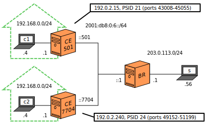

# MAP-T Run

## Index

1. [Introduction](#introduction)
2. [Sample Network](#sample-network)
3. [Jool](#jool)
4. [Testing](#testing)
5. [Stopping Jool](#stopping-jool)
6. [Afterwords](#afterwords)

## Introduction

This document explains how to run Jool in [MAP-T mode](intro-xlat.html#map-t).

## Sample Network


This network was explained in the [MAP-T summary](map-t.html).

To prevent this tutorial from dragging on, we'll reduce it to a couple of CEs:



CE 501's basic network configuration:

```bash
user@CE501:~# service network-manager stop
user@CE501:~#
user@CE501:~# /sbin/ip link set eth0 up
user@CE501:~# /sbin/ip address add 192.168.0.1/24 dev eth0
user@CE501:~#
user@CE501:~# /sbin/ip link set eth1 up
user@CE501:~# /sbin/ip address add 2001:db8:0:6::501/64 dev eth1
user@CE501:~#
user@CE501:~# /sbin/ip route add 64:ff9b::/96 via 2001:db8:6::1
user@CE501:~#
user@CE501:~# /sbin/sysctl -w net.ipv4.conf.all.forwarding=1
user@CE501:~# /sbin/sysctl -w net.ipv6.conf.all.forwarding=1
```

CE 7704's basic network configuration:

```bash
user@CE7704:~# service network-manager stop
user@CE7704:~#
user@CE7704:~# /sbin/ip link set eth0 up
user@CE7704:~# /sbin/ip address add 192.168.0.1/24 dev eth0
user@CE7704:~#
user@CE7704:~# /sbin/ip link set eth1 up
user@CE7704:~# /sbin/ip address add 2001:db8:0:6::7704/64 dev eth1
user@CE7704:~#
user@CE7704:~# /sbin/ip route add 64:ff9b::/96 via 2001:db8:6::1
user@CE7704:~#
user@CE7704:~# /sbin/sysctl -w net.ipv4.conf.all.forwarding=1
user@CE7704:~# /sbin/sysctl -w net.ipv6.conf.all.forwarding=1
```

BR's network configuration:

```bash
user@BR:~# service network-manager stop
user@BR:~#
user@BR:~# /sbin/ip link set eth0 up
user@BR:~# /sbin/ip address add 2001:db8:0:6::1/64 dev eth0
user@BR:~#
user@BR:~# /sbin/ip link set eth1 up
user@BR:~# /sbin/ip address add 203.0.113.1/24 dev eth1
user@BR:~#
user@BR:~# /sbin/ip route add 2001:db8:0:4464:501::/80  via 2001:db8:0:6::501
user@BR:~# /sbin/ip route add 2001:db8:0:4464:7704::/80 via 2001:db8:0:6::7704
user@BR:~#
user@BR:~# /sbin/sysctl -w net.ipv4.conf.all.forwarding=1
user@BR:~# /sbin/sysctl -w net.ipv6.conf.all.forwarding=1
```

## Jool

### CE 501

```bash
user@CE501:~# # NAPT
user@CE501:~#
user@CE501:~# # Translator
user@CE501:~# /sbin/modprobe jool_mapt
user@CE501:~# jool_mapt instance add "CE 501" --netfilter \
		--end-user-ipv6-prefix 2001:db8:0:4464:501::/80 \
		--bmr.prefix6 2001:db8:0:4464::/67 \
		--bmr.prefix4 192.0.2.0/24 \
		--bmr.ea-bits-length 13 \
		--dmr 64:ff9b::/96 \
		--a 0
```

### CE 7704

```bash
user@CE7704:~# /sbin/modprobe jool_mapt
user@CE7704:~# jool_mapt instance add "CE 7704" --netfilter \
		--end-user-ipv6-prefix 2001:db8:0:4464:7704::/80 \
		--bmr.prefix6 2001:db8:0:4464::/67 \
		--bmr.prefix4 192.0.2.0/24 \
		--bmr.ea-bits-length 13 \
		--dmr 64:ff9b::/96 \
		--a 0
```

### BR

```bash
user@BR:~# /sbin/modprobe jool_mapt
user@BR:~# jool_mapt instance add "BR" --netfilter \
		--dmr 64:ff9b::/96 \
		--a 0
user@BR:~# jool_mapt -i "BR" fmr add 2001:db8:0:4464:/96 192.0.2.0/24 13
```

## Testing

## Stopping Jool

```bash
user@CE501:~# jool_mapt instance remove "CE501"
user@CE501:~# /sbin/modprobe -r jool_mapt
```

etc.

## Afterwords

1. If you care about performance, you might want to raise [`lowest-ipv6-mtu`](mtu.html).
2. Please note that none of what was done in this tutorial survives reboots! [Here](run-persistent.html)'s documentation on persistence.

