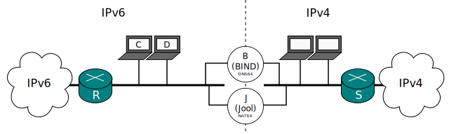

[Documentation](documentation.html) > [Basic Tutorials](documentation.html#basic-tutorials) > DNS64

# DNS64 Tutorial

## Index

1. [Introduction](#introduction)
2. [Network](#network)
3. [Configuration](#configuration)
   1. [BIND](#bind)
   2. [Everything else](#everything-else)
4. [Outcome](#outcome)

## Introduction

This document focuses on DNS64, the last key to have a fully-sensical NAT64 installation.

Any correct DNS64 implementation is supposed to work; BIND will be used for illustration here. I expect you to be already familiarized with DNS and have at least an idea of what BIND's configuration looks like.

## Network

Though Jool and the DNS64 are portrayed as separate nodes, there's nothing (aside from [port collision](pool4.html)) preventing you from joining them in a single machine.

## Configuration

### BIND

First, I will clarify what we want to achieve.

`example.com` is a domain that is available from both the IPv4 and the IPv6 internets, and hence it has both kinds of records:


$ dig example.com A
(...)
;; ANSWER SECTION:
example.com.		66029	IN	A	93.184.216.119
(...)

$ dig example.com AAAA
(...)
;; ANSWER SECTION:
example.com.		86040	IN	AAAA	2606:2800:220:6d:26bf:1447:1097:aa7
(...)


`nat64-tutorial.mx` is an example of a domain available only from IPv4:


$ dig nat64-tutorial.mx A
(...)
;; ANSWER SECTION:
nat64-tutorial.mx.	66029	IN	A	200.94.182.36
(...)

$ dig nat64-tutorial.mx AAAA
(...)
;; AUTHORITY SECTION:
nat64-tutorial.mx.	240	IN	SOA	potato.mx. hostmaster.jool.mx. 2013070801 3600 900 604800 1800
(...)


There's no need for an IPv6 node to access `example.com` via the NAT64. On the other hand, `nat64-tutorial.mx` cannot be accessed from IPv6 without one.

In other words, we want the DNS64 service to return `2606:2800:220:6d:26bf:1447:1097:aa7` when asked for the AAAA record of `example.com` (which is what it normally does), and `64:ff9b::200.94.182.36` (i.e. the NAT64 prefix plus the IPv4 address) when asked for the AAAA record of `nat64-tutorial.mx` (which is the whole NAT64 hack).

First, have a working BIND server. On Ubuntu, the only thing you have to do (assuming you don't already have one) is run


user@B:~# apt-get install bind9


The most basic configuration is very minimalistic. In order to turn on DNS64, the options section from the named.conf file (in my case, `/etc/bind/named.conf.options`) is the only one in which statements must be updated:

	options {
		(...)

		# Listening on IPv6 is off by default.
		listen-on-v6 { any; };

		# This is the key. Note that you can write multiple of these if you need
		# more IPv6 prefixes.
		# "64:ff9b::/96" has to be the same as Jool's `pool6`.
		dns64 64:ff9b::/96 {
			# Options per prefix (if you need them) here.
			# More info here: https://kb.isc.org/article/AA-01031
		};
	};

And remember to reload.


user@B:~# sudo service bind9 restart


That's it!

### Everything else

The outermost networks changed, and that should probably be reflected in everyone's routing tables:


user@J:~# /sbin/ip -6 route del 2001:db8:1::/64
user@J:~# /sbin/ip -6 route add default via 2001:db8:2::1 dev eth0


(Similar instructions should be echoed in the routers and the nodes)

Jool and _J_ don't need to be aware of the DNS64 because domain names are completely transparent to NAT64, so you don't need to do anything else in _J_. 

As for the leaf nodes, any IPv6 node which needs to access IPv4-only content _should_ use the DNS64 as its default name server (unless you want to specify it manually in your dig commands, I guess).

## Outcome

From one of those IPv6 nodes:


$ dig example.com AAAA
(...)
;; ANSWER SECTION:
example.com.		86040	IN	AAAA	2606:2800:220:6d:26bf:1447:1097:aa7
(...)

$ dig nat64-tutorial.mx AAAA
(...)
;; AUTHORITY SECTION:
nat64-tutorial.mx.	86040	IN	AAAA	64:ff9b::c85e:b624
(...)


If you sniff the traffic, you should see packets towards `example.com` on R, and packets towards `nat64-tutorial.mx` via S:

Happy ending!

